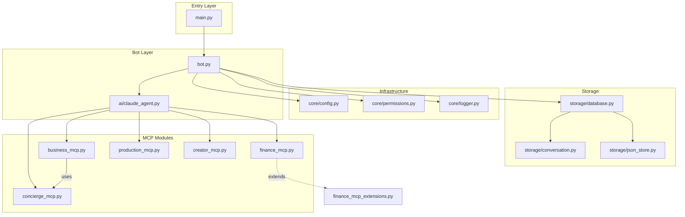
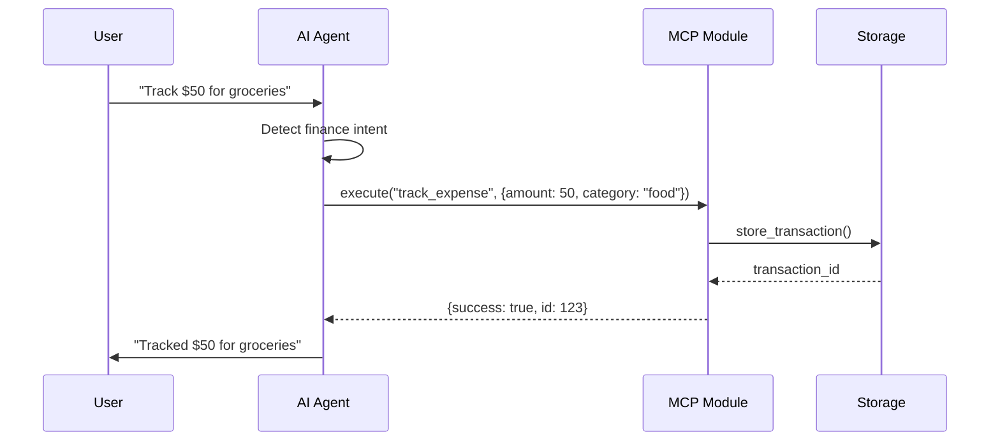

# PROJECT_MAP.md - Umbra MCP Project Structure

## Directory Tree

```
Umbra/
├── main.py                      # Entry point - Production launcher with health monitoring
├── requirements.txt             # Python dependencies
├── Dockerfile                   # Container configuration
├── pyproject.toml              # Ruff linter configuration  
├── .gitignore                  # Git ignore rules
├── .dockerignore               # Docker ignore rules
├── LICENSE                     # MIT License
│
└── umbra/                      # Main application package
    ├── __init__.py             # Package initialization, exports main classes
    ├── __main__.py             # Package entry point for python -m umbra
    ├── bot.py                  # UmbraAIAgent - Main bot orchestrator
    │
    ├── ai/                     # AI and conversation handling
    │   ├── __init__.py         # AI module exports
    │   └── claude_agent.py     # Claude Desktop-style intelligent agent
    │
    ├── core/                   # Core infrastructure
    │   ├── __init__.py         # Core module exports
    │   ├── config.py           # Configuration management with env vars
    │   ├── permissions.py      # User authorization and permission checks
    │   └── logger.py           # Structured logging system
    │
    ├── modules/                # MCP-style specialized modules
    │   ├── __init__.py         # Module exports
    │   ├── concierge_mcp.py   # VPS/System management module
    │   ├── finance_mcp.py     # Personal finance tracking module
    │   ├── finance_mcp_extensions.py # Enhanced finance features
    │   ├── business_mcp.py    # Business/client management module
    │   ├── production_mcp.py  # n8n workflow automation module
    │   └── creator_mcp.py     # Content creation module
    │
    └── storage/                # Data persistence layer
        ├── __init__.py         # Storage exports
        ├── database.py         # SQLite database manager
        ├── conversation.py     # Conversation history manager
        └── json_store.py       # JSON-based key-value storage
```

## Module Relationships

### Core Dependencies



## File Purposes & Relationships

### Root Files

| File | Purpose | Dependencies | Dependents |
|------|---------|-------------|------------|
| `main.py` | Production entry point, health server, lifecycle management | umbra.bot, aiohttp | - |
| `requirements.txt` | Python package specifications | - | Docker, deployment |
| `Dockerfile` | Container build instructions | requirements.txt, main.py | Deployment |
| `pyproject.toml` | Code quality configuration (Ruff) | - | Development |
| `.gitignore` | Version control exclusions | - | Git |
| `.dockerignore` | Docker build exclusions | - | Docker |

### Core Package (`umbra/`)

| File | Purpose | Imports From | Imported By |
|------|---------|--------------|-------------|
| `__init__.py` | Package exports | bot.py | main.py |
| `__main__.py` | CLI entry point | bot.py | python -m umbra |
| `bot.py` | Main orchestrator, Telegram handlers | core/*, storage/*, ai/*, modules/* | main.py, __main__.py |

### AI Module (`umbra/ai/`)

| File | Purpose | Key Functions | Uses Modules |
|------|---------|---------------|--------------|
| `claude_agent.py` | Natural language processing, intent detection, module selection | `process()`, `select_module()`, `execute_module()` | All MCP modules |

**Key Responsibilities**:
- Parse user messages for intent
- Determine which module(s) to use
- Execute module actions
- Format responses

### Core Infrastructure (`umbra/core/`)

| File | Purpose | Key Classes/Functions | Used By |
|------|---------|---------------------|----------|
| `config.py` | Environment variables, feature flags | `UmbraConfig`, `config` | All modules |
| `permissions.py` | User authorization | `PermissionManager` | bot.py, modules |
| `logger.py` | Structured logging | `setup_logging()`, `get_logger()` | All modules |

**Configuration Flow**:
```
Environment Variables → config.py → All Components
```

### MCP Modules (`umbra/modules/`)

Each module follows the same pattern:

```python
class ModuleMCP:
    __init__(config, db_manager)
    execute(action, params) -> response
    get_capabilities() -> list
```

#### Module Capabilities Matrix

| Module | Primary Domain | Key Actions | External Dependencies |
|--------|---------------|-------------|----------------------|
| `concierge_mcp.py` | VPS Management | `check_system`, `manage_docker`, `execute_ssh` | psutil, docker, subprocess |
| `finance_mcp.py` | Personal Finance | `track_expense`, `set_budget`, `generate_report` | - |
| `finance_mcp_extensions.py` | Enhanced Finance | `ocr_receipt`, `investment_tracking` | boto3, yfinance |
| `business_mcp.py` | Client Management | `create_instance`, `manage_client`, `generate_invoice` | concierge_mcp |
| `production_mcp.py` | Automation | `create_workflow`, `deploy_automation` | n8n API |
| `creator_mcp.py` | Content Creation | `generate_image`, `create_document` | OpenAI, Stability APIs |

#### Module Interaction Patterns



### Storage Layer (`umbra/storage/`)

| File | Purpose | Main Classes | Schema/Structure |
|------|---------|-------------|-----------------|
| `database.py` | SQLite operations | `DatabaseManager` | users, conversations, finance_*, business_* |
| `conversation.py` | Chat history | `ConversationManager` | messages table |
| `json_store.py` | Key-value storage | `JSONStore` | Flat JSON files |

**Database Schema Overview**:

```sql
-- Core Tables
users (id, telegram_id, username, first_name, last_name, created_at)
conversations (id, user_id, message, response, timestamp)

-- Finance Module Tables  
finance_transactions (id, user_id, amount, category, description, date)
finance_budgets (id, user_id, category, amount, period)

-- Business Module Tables
business_clients (id, name, contact, created_at)
business_projects (id, client_id, name, status, created_at)
```

## Data Flow Paths

### 1. Message Processing Path

```
Telegram API → main.py → bot.py → AI Agent → Module → Storage → Response
```

### 2. Module Execution Path

```
AI Agent → Module Selection → Action Parsing → Module.execute() → Database → Format Response
```

### 3. Configuration Loading Path

```
Environment → config.py → Module Initialization → Runtime Configuration
```

## Module Communication Patterns

### Direct Dependencies

- **bot.py** → All modules (initialization)
- **AI Agent** → All modules (execution)
- **business_mcp** → concierge_mcp (VPS operations)
- **finance_mcp** → finance_mcp_extensions (enhanced features)

### Shared Resources

- **Database**: All modules share the same SQLite database
- **Configuration**: Global config object shared across modules
- **Logger**: Centralized logging system

### Communication Protocol

Modules communicate via structured dictionaries:

```python
# Request format
request = {
    "action": "check_system",
    "params": {
        "metric": "cpu",
        "duration": "5m"
    },
    "user_id": 123456789,
    "context": {"is_admin": True}
}

# Response format
response = {
    "success": True,
    "data": {
        "cpu_usage": 15.2,
        "timestamp": "2024-01-15T10:30:00Z"
    },
    "message": "CPU usage is at 15.2%"
}
```

## Extension Points

### Adding New Modules

1. Create `umbra/modules/new_module_mcp.py`
2. Implement the MCP interface:
   ```python
   class NewModuleMCP:
       def __init__(self, config, db_manager):
           pass
       async def execute(self, action, params):
           pass
   ```
3. Register in `bot.py._init_mcp_modules()`
4. Add capability detection in `ai/claude_agent.py`

### Adding New Storage Types

1. Create `umbra/storage/new_store.py`
2. Implement storage interface
3. Register in `storage/__init__.py`
4. Update `database.py` if SQL schema needed

### Adding New AI Providers

1. Extend `ai/claude_agent.py`
2. Add provider configuration in `core/config.py`
3. Implement provider-specific logic

## Build & Runtime Dependencies

### Python Package Dependencies

**Core** (Always Required):
- `python-telegram-bot`: Telegram bot framework
- `aiohttp`: Async HTTP server/client
- `aiosqlite`: Async SQLite operations
- `python-dotenv`: Environment variable management

**Optional Features**:
- `openai`: AI conversation capabilities
- `boto3`: S3/R2 storage (future)
- `psutil`: System monitoring (Concierge)
- `docker`: Container management (Concierge)
- `Pillow`: Image processing (Creator)

### System Dependencies

**Docker Container**:
- Python 3.11+
- gcc (compilation)
- docker.io (optional, for container management)

## Configuration Requirements

### Required Environment Variables

| Variable | Source | Purpose |
|----------|--------|---------|
| `TELEGRAM_BOT_TOKEN` | @BotFather | Bot authentication |
| `ALLOWED_USER_IDS` | @userinfobot | Authorized users |
| `ALLOWED_ADMIN_IDS` | Manual | Admin users |

### Optional Environment Variables

| Variable | Purpose | Default |
|----------|---------|---------|
| `OPENROUTER_API_KEY` | AI capabilities | None (pattern mode) |
| `DATABASE_PATH` | SQLite location | data/umbra.db |
| `LOG_LEVEL` | Logging detail | INFO |
| `PORT` | Health server port | 8000 |

## Testing & Development

### Local Development Setup

```bash
# 1. Clone repository
git clone <repo-url>
cd Umbra

# 2. Create virtual environment
python -m venv venv
source venv/bin/activate  # or venv\Scripts\activate on Windows

# 3. Install dependencies
pip install -r requirements.txt

# 4. Configure environment
cp .env.example .env
# Edit .env with your tokens

# 5. Run locally
python main.py
```

### Module Testing Pattern

```python
# Test individual module
from umbra.modules.finance_mcp import FinanceMCP
from umbra.storage.database import DatabaseManager

db = DatabaseManager("test.db")
finance = FinanceMCP(config, db)

result = await finance.execute("track_expense", {
    "amount": 50,
    "category": "food"
})
```

## Deployment Paths

### Docker Deployment

```bash
docker build -t umbra-mcp .
docker run -e TELEGRAM_BOT_TOKEN=xxx umbra-mcp
```

### Railway Deployment

1. Connect GitHub repository
2. Set environment variables
3. Deploy (auto-builds from Dockerfile)

### Direct Python Deployment

```bash
pip install -r requirements.txt
python main.py
```

## Maintenance & Operations

### Log Files

Logs are output to stdout/stderr for container compatibility. In production, logs are captured by the container runtime.

### Database Maintenance

- Location: `data/umbra.db` (configurable)
- Backup: Copy SQLite file
- Migration: Use scripts in `/scripts` directory

### Health Monitoring

- Endpoint: `http://localhost:8000/health`
- Checks: Bot status, module health
- Integration: Container health checks

## Security Considerations

### Data Protection

- User IDs validated against allowlist
- Admin operations require admin IDs
- Rate limiting enforced
- Sensitive data sanitized in logs

### API Key Management

- Never commit keys to repository
- Use environment variables
- Rotate keys regularly
- Monitor usage

## Future Expansion Areas

1. **Additional Modules**: Analytics, monitoring, automation
2. **Storage Backends**: PostgreSQL, Redis, R2/S3
3. **AI Providers**: Anthropic, Google, local models
4. **Deployment Targets**: Kubernetes, Lambda, Edge

## Conclusion

This project map provides a complete overview of the Umbra MCP system structure, showing how each component fits together to create a modular, extensible Claude Desktop-style AI assistant. The clean separation of concerns allows for easy maintenance and feature additions while keeping the codebase organized and efficient.
