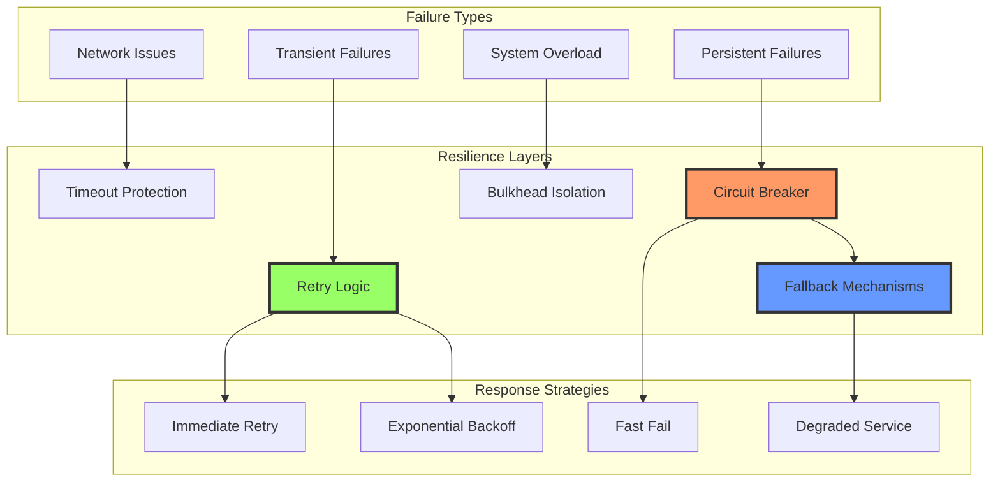
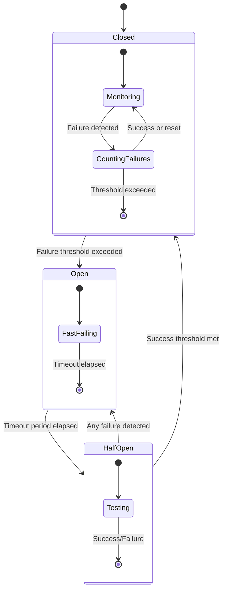

````markdown
# Circuit Breaker & Retry Patterns - Resiliency Primitives

A comprehensive guide to implementing robust circuit breaker and retry mechanisms for the Umbra Bot system, ensuring operational resilience and graceful degradation under failure conditions.

## Table of Contents

1. [Overview](#overview)
2. [Circuit Breaker Design](#circuit-breaker-design)
3. [RetryManager Strategies](#retrymanager-strategies)
4. [Error Classification](#error-classification)
5. [Implementation Patterns](#implementation-patterns)
6. [Monitoring & Observability](#monitoring--observability)
7. [Configuration Management](#configuration-management)
8. [Best Practices](#best-practices)

## Overview

### Resilience Principles

The Umbra Bot system implements multiple layers of resilience to handle failures gracefully:



### Key Components

1. **CircuitBreaker**: Prevents cascading failures by stopping calls to failing services
2. **RetryManager**: Implements intelligent retry strategies with backoff algorithms
3. **ErrorClassifier**: Categorizes errors for appropriate handling strategies
4. **FallbackProvider**: Provides alternative responses when primary services fail
5. **HealthMonitor**: Tracks service health and recovery patterns

## Circuit Breaker Design

### State Machine

The circuit breaker operates as a finite state machine with three primary states:



### CircuitBreaker Implementation

**Core CircuitBreaker Class**:
```typescript
enum CircuitState {
  CLOSED = 'closed',
  OPEN = 'open',
  HALF_OPEN = 'half_open'
}

interface CircuitBreakerConfig {
  name: string;
  failureThreshold: number;        // Number of failures to trigger open
  successThreshold: number;        // Successes needed to close from half-open
  timeout: number;                 // Time in ms before trying half-open
  monitoringWindow: number;        // Rolling window size in ms
  volumeThreshold: number;         // Minimum calls before considering failure rate
  slowCallThreshold: number;       // Threshold for slow call detection (ms)
  slowCallRateThreshold: number;   // Percentage of slow calls to trigger open
}

class CircuitBreaker {
  private state: CircuitState = CircuitState.CLOSED;
  private failureCount: number = 0;
  private successCount: number = 0;
  private lastFailureTime: number = 0;
  private lastStateChangeTime: number = Date.now();
  private recentCalls: CallRecord[] = [];
  private config: CircuitBreakerConfig;
  private logger: Logger;
  private metrics: CircuitBreakerMetrics;

  constructor(config: CircuitBreakerConfig) {
    this.config = config;
    this.logger = new Logger(`CircuitBreaker:${config.name}`);
    this.metrics = new CircuitBreakerMetrics(config.name);
  }

  async execute<T>(operation: () => Promise<T>): Promise<T> {
    const startTime = Date.now();
    
    // Check if circuit is open
    if (this.state === CircuitState.OPEN) {
      if (this.shouldAttemptReset()) {
        this.transitionToHalfOpen();
      } else {
        this.metrics.recordRejection();
        throw new CircuitBreakerOpenError(
          `Circuit breaker ${this.config.name} is OPEN`
        );
      }
    }

    try {
      const result = await this.executeWithTimeout(operation, startTime);
      this.onSuccess(Date.now() - startTime);
      return result;
    } catch (error) {
      this.onFailure(error, Date.now() - startTime);
      throw error;
    }
  }

  private async executeWithTimeout<T>(
    operation: () => Promise<T>,
    startTime: number
  ): Promise<T> {
    const timeoutPromise = new Promise<never>((_, reject) => {
      setTimeout(() => {
        reject(new TimeoutError(`Operation timed out after ${this.config.slowCallThreshold}ms`));
      }, this.config.slowCallThreshold);
    });

    return Promise.race([operation(), timeoutPromise]);
  }

  private onSuccess(duration: number): void {
    this.recordCall(true, duration);
    
    if (this.state === CircuitState.HALF_OPEN) {
      this.successCount++;
      this.logger.debug('Half-open success', { 
        successCount: this.successCount, 
        threshold: this.config.successThreshold 
      });
      
      if (this.successCount >= this.config.successThreshold) {
        this.transitionToClosed();
      }
    } else if (this.state === CircuitState.CLOSED) {
      // Reset failure count on success in closed state
      this.failureCount = 0;
    }
    
    this.metrics.recordSuccess(duration);
  }

  private onFailure(error: Error, duration: number): void {
    this.recordCall(false, duration);
    this.lastFailureTime = Date.now();
    
    if (this.state === CircuitState.HALF_OPEN) {
      // Any failure in half-open immediately opens the circuit
      this.transitionToOpen();
    } else if (this.state === CircuitState.CLOSED) {
      this.failureCount++;
      
      if (this.shouldOpenCircuit()) {
        this.transitionToOpen();
      }
    }
    
    this.metrics.recordFailure(duration, error);
  }

  private shouldOpenCircuit(): boolean {
    // Check failure threshold
    if (this.failureCount >= this.config.failureThreshold) {
      return true;
    }
    
    // Check volume threshold and failure rate
    const recentCalls = this.getRecentCalls();
    if (recentCalls.length < this.config.volumeThreshold) {
      return false;
    }
    
    const failureRate = this.calculateFailureRate(recentCalls);
    const slowCallRate = this.calculateSlowCallRate(recentCalls);
    
    return failureRate >= 0.5 || slowCallRate >= this.config.slowCallRateThreshold;
  }

  private shouldAttemptReset(): boolean {
    const timeSinceLastStateChange = Date.now() - this.lastStateChangeTime;
    return timeSinceLastStateChange >= this.config.timeout;
  }

  private transitionToClosed(): void {
    this.logger.info('Circuit breaker transitioning to CLOSED');
    this.state = CircuitState.CLOSED;
    this.failureCount = 0;
    this.successCount = 0;
    this.lastStateChangeTime = Date.now();
    this.metrics.recordStateChange(CircuitState.CLOSED);
  }

  private transitionToOpen(): void {
    this.logger.warn('Circuit breaker transitioning to OPEN', {
      failureCount: this.failureCount,
      lastFailure: new Date(this.lastFailureTime).toISOString()
    });
    this.state = CircuitState.OPEN;
    this.lastStateChangeTime = Date.now();
    this.metrics.recordStateChange(CircuitState.OPEN);
  }

  private transitionToHalfOpen(): void {
    this.logger.info('Circuit breaker transitioning to HALF_OPEN');
    this.state = CircuitState.HALF_OPEN;
    this.successCount = 0;
    this.lastStateChangeTime = Date.now();
    this.metrics.recordStateChange(CircuitState.HALF_OPEN);
  }

  private recordCall(success: boolean, duration: number): void {
    const call: CallRecord = {
      timestamp: Date.now(),
      success,
      duration
    };
    
    this.recentCalls.push(call);
    
    // Keep only calls within the monitoring window
    const cutoff = Date.now() - this.config.monitoringWindow;
    this.recentCalls = this.recentCalls.filter(call => call.timestamp > cutoff);
  }

  private getRecentCalls(): CallRecord[] {
    const cutoff = Date.now() - this.config.monitoringWindow;
    return this.recentCalls.filter(call => call.timestamp > cutoff);
  }

  private calculateFailureRate(calls: CallRecord[]): number {
    if (calls.length === 0) return 0;
    const failures = calls.filter(call => !call.success).length;
    return failures / calls.length;
  }

  private calculateSlowCallRate(calls: CallRecord[]): number {
    if (calls.length === 0) return 0;
    const slowCalls = calls.filter(call => call.duration > this.config.slowCallThreshold).length;
    return slowCalls / calls.length;
  }

  // Public API for monitoring
  getState(): CircuitState {
    return this.state;
  }

  getMetrics(): CircuitBreakerStats {
    const recentCalls = this.getRecentCalls();
    return {
      state: this.state,
      failureCount: this.failureCount,
      successCount: this.successCount,
      lastFailureTime: this.lastFailureTime,
      recentCallsCount: recentCalls.length,
      failureRate: this.calculateFailureRate(recentCalls),
      slowCallRate: this.calculateSlowCallRate(recentCalls)
    };
  }
}
```

### Fallback Behavior

**Fallback Strategy Implementation**:
```typescript
interface FallbackStrategy<T> {
  execute(): Promise<T>;
  isApplicable(error: Error): boolean;
  getPriority(): number;
}

class FallbackManager<T> {
  private strategies: FallbackStrategy<T>[] = [];
  private logger: Logger;

  constructor(name: string) {
    this.logger = new Logger(`FallbackManager:${name}`);
  }

  addStrategy(strategy: FallbackStrategy<T>): void {
    this.strategies.push(strategy);
    this.strategies.sort((a, b) => b.getPriority() - a.getPriority());
  }

  async executeFallback(originalError: Error): Promise<T> {
    this.logger.warn('Executing fallback strategies', { 
      originalError: originalError.message,
      availableStrategies: this.strategies.length 
    });

    for (const strategy of this.strategies) {
      if (strategy.isApplicable(originalError)) {
        try {
          this.logger.info('Attempting fallback strategy', { 
            strategy: strategy.constructor.name 
          });
          
          const result = await strategy.execute();
          
          this.logger.info('Fallback strategy succeeded', { 
            strategy: strategy.constructor.name 
          });
          
          return result;
        } catch (fallbackError) {
          this.logger.warn('Fallback strategy failed', {
            strategy: strategy.constructor.name,
            error: fallbackError.message
          });
        }
      }
    }

    // No fallback strategy worked
    throw new FallbackExhaustedError(
      'All fallback strategies failed',
      originalError
    );
  }
}

// Example fallback strategies for AI providers
class SecondaryAIProviderFallback implements FallbackStrategy<AIResponse> {
  constructor(private secondaryProvider: AIProvider) {}

  async execute(): Promise<AIResponse> {
    return this.secondaryProvider.generateResponse({
      prompt: this.fallbackPrompt,
      model: 'gpt-3.5-turbo' // Use faster, cheaper model for fallback
    });
  }

  isApplicable(error: Error): boolean {
    return error instanceof AIProviderError && 
           (error.code === 'RATE_LIMIT' || error.code === 'SERVICE_UNAVAILABLE');
  }

  getPriority(): number {
    return 100; // High priority
  }
}

class CachedResponseFallback implements FallbackStrategy<AIResponse> {
  constructor(private cache: Cache) {}

  async execute(): Promise<AIResponse> {
    const cachedResponse = await this.cache.get('last_successful_response');
    if (!cachedResponse) {
      throw new Error('No cached response available');
    }
    
    return {
      ...cachedResponse,
      fromCache: true,
      warning: 'This is a cached response due to service unavailability'
    };
  }

  isApplicable(error: Error): boolean {
    return true; // Can be used for any error as last resort
  }

  getPriority(): number {
    return 10; // Low priority - last resort
  }
}
```

### Circuit Breaker Alerting

**Alert Integration**:
```typescript
class CircuitBreakerAlertManager {
  private alertManager: AlertManager;
  private alertStates: Map<string, AlertState>;

  constructor(alertManager: AlertManager) {
    this.alertManager = alertManager;
    this.alertStates = new Map();
  }

  onStateChange(circuitName: string, newState: CircuitState, metrics: CircuitBreakerStats): void {
    const alertState = this.alertStates.get(circuitName) || { lastAlert: 0, alertCount: 0 };

    switch (newState) {
      case CircuitState.OPEN:
        this.sendAlert(circuitName, 'circuit_breaker_opened', {
          circuitName,
          failureCount: metrics.failureCount,
          failureRate: metrics.failureRate,
          lastFailureTime: metrics.lastFailureTime,
          severity: 'high'
        });
        break;

      case CircuitState.HALF_OPEN:
        this.sendAlert(circuitName, 'circuit_breaker_testing', {
          circuitName,
          severity: 'medium'
        });
        break;

      case CircuitState.CLOSED:
        if (alertState.alertCount > 0) {
          this.sendAlert(circuitName, 'circuit_breaker_recovered', {
            circuitName,
            downtime: Date.now() - metrics.lastFailureTime,
            severity: 'info'
          });
          
          // Reset alert state
          this.alertStates.set(circuitName, { lastAlert: 0, alertCount: 0 });
        }
        break;
    }
  }

  private sendAlert(circuitName: string, alertType: string, context: any): void {
    const now = Date.now();
    const alertState = this.alertStates.get(circuitName) || { lastAlert: 0, alertCount: 0 };

    // Throttling: don't send same alert type more than once per minute
    if (now - alertState.lastAlert < 60000 && alertType === 'circuit_breaker_opened') {
      return;
    }

    this.alertManager.sendAlert(alertType, context);
    
    this.alertStates.set(circuitName, {
      lastAlert: now,
      alertCount: alertState.alertCount + 1
    });
  }
}
```

## RetryManager Strategies

### Retry Strategy Types

**Strategy Enumeration**:
```typescript
enum RetryStrategy {
  IMMEDIATE = 'immediate',
  FIXED_DELAY = 'fixed_delay',
  LINEAR_BACKOFF = 'linear_backoff',
  EXPONENTIAL_BACKOFF = 'exponential_backoff',
  CUSTOM = 'custom'
}

interface RetryConfig {
  strategy: RetryStrategy;
  maxAttempts: number;
  baseDelay: number;          // milliseconds
  maxDelay: number;           // milliseconds
  multiplier?: number;        // for exponential/linear backoff
  jitter?: boolean;           // add randomization
  retryCondition?: (error: Error) => boolean;
}
```

**RetryManager Implementation**:
```typescript
class RetryManager {
  private errorClassifier: ErrorClassifier;
  private metrics: RetryMetrics;
  private logger: Logger;

  constructor(name: string) {
    this.errorClassifier = new ErrorClassifier();
    this.metrics = new RetryMetrics(name);
    this.logger = new Logger(`RetryManager:${name}`);
  }

  async execute<T>(
    operation: () => Promise<T>,
    config: RetryConfig,
    context: RetryContext = {}
  ): Promise<T> {
    let attempt = 0;
    let lastError: Error;
    const startTime = Date.now();

    while (attempt <= config.maxAttempts) {
      try {
        const result = await operation();
        
        if (attempt > 0) {
          this.metrics.recordSuccess(attempt, Date.now() - startTime);
          this.logger.info('Operation succeeded after retry', {
            attempt,
            operation: context.operationName,
            totalDuration: Date.now() - startTime
          });
        }
        
        return result;
      } catch (error) {
        lastError = error;
        attempt++;

        // Check if error is retryable
        const classification = this.errorClassifier.classify(error);
        if (!classification.retryable) {
          this.metrics.recordNonRetryableFailure(error);
          this.logger.debug('Error not retryable', {
            error: error.message,
            classification: classification.category
          });
          throw error;
        }

        // Check custom retry condition
        if (config.retryCondition && !config.retryCondition(error)) {
          this.metrics.recordConditionFailure(error);
          this.logger.debug('Custom retry condition failed', {
            error: error.message
          });
          throw error;
        }

        // Check if max attempts reached
        if (attempt > config.maxAttempts) {
          this.metrics.recordMaxAttemptsExceeded(attempt - 1, Date.now() - startTime);
          this.logger.error('Max retry attempts exceeded', {
            maxAttempts: config.maxAttempts,
            finalError: error.message,
            totalDuration: Date.now() - startTime
          });
          throw new MaxRetriesExceededError(
            `Max retries (${config.maxAttempts}) exceeded`,
            error,
            attempt - 1
          );
        }

        // Calculate delay
        const delay = this.calculateDelay(attempt, config);
        
        this.metrics.recordRetryAttempt(attempt, delay, error);
        this.logger.warn('Operation failed - retrying', {
          attempt,
          error: error.message,
          nextRetryIn: delay,
          classification: classification.category
        });

        await this.sleep(delay);
      }
    }

    throw lastError!;
  }

  private calculateDelay(attempt: number, config: RetryConfig): number {
    let delay: number;

    switch (config.strategy) {
      case RetryStrategy.IMMEDIATE:
        delay = 0;
        break;

      case RetryStrategy.FIXED_DELAY:
        delay = config.baseDelay;
        break;

      case RetryStrategy.LINEAR_BACKOFF:
        delay = config.baseDelay * attempt * (config.multiplier || 1);
        break;

      case RetryStrategy.EXPONENTIAL_BACKOFF:
        delay = config.baseDelay * Math.pow(config.multiplier || 2, attempt - 1);
        break;

      default:
        delay = config.baseDelay;
    }

    // Apply jitter if enabled
    if (config.jitter) {
      const jitterRange = delay * 0.1; // 10% jitter
      const jitterOffset = (Math.random() - 0.5) * 2 * jitterRange;
      delay += jitterOffset;
    }

    // Ensure delay doesn't exceed maximum
    delay = Math.min(delay, config.maxDelay);
    
    // Ensure delay is not negative
    delay = Math.max(delay, 0);

    return Math.round(delay);
  }

  private sleep(ms: number): Promise<void> {
    return new Promise(resolve => setTimeout(resolve, ms));
  }

  getMetrics(): RetryMetricsSnapshot {
    return this.metrics.getSnapshot();
  }
}
```

### Retry Strategy Configurations

**Predefined Strategy Configurations**:
```typescript
const RETRY_STRATEGIES = {
  // For network-related errors
  NETWORK_RETRY: {
    strategy: RetryStrategy.EXPONENTIAL_BACKOFF,
    maxAttempts: 3,
    baseDelay: 1000,
    maxDelay: 30000,
    multiplier: 2,
    jitter: true,
    retryCondition: (error: Error) => 
      error instanceof NetworkError || 
      error.message.includes('ECONNRESET') ||
      error.message.includes('ETIMEDOUT')
  },

  // For rate limiting errors
  RATE_LIMIT_RETRY: {
    strategy: RetryStrategy.FIXED_DELAY,
    maxAttempts: 5,
    baseDelay: 5000,
    maxDelay: 60000,
    jitter: true,
    retryCondition: (error: Error) =>
      error instanceof RateLimitError ||
      error.message.includes('rate limit') ||
      error.message.includes('429')
  },

  // For AI provider errors
  AI_PROVIDER_RETRY: {
    strategy: RetryStrategy.EXPONENTIAL_BACKOFF,
    maxAttempts: 2,
    baseDelay: 2000,
    maxDelay: 15000,
    multiplier: 2,
    jitter: true,
    retryCondition: (error: Error) => {
      if (error instanceof AIProviderError) {
        return error.retryable;
      }
      return false;
    }
  },

  // For file processing operations
  FILE_PROCESSING_RETRY: {
    strategy: RetryStrategy.LINEAR_BACKOFF,
    maxAttempts: 2,
    baseDelay: 3000,
    maxDelay: 10000,
    multiplier: 1.5,
    jitter: false,
    retryCondition: (error: Error) =>
      !error.message.includes('invalid format') &&
      !error.message.includes('corrupted')
  },

  // For database operations
  DATABASE_RETRY: {
    strategy: RetryStrategy.EXPONENTIAL_BACKOFF,
    maxAttempts: 4,
    baseDelay: 500,
    maxDelay: 10000,
    multiplier: 2,
    jitter: true,
    retryCondition: (error: Error) =>
      error.message.includes('connection') ||
      error.message.includes('timeout') ||
      error.message.includes('deadlock')
  }
};
```

### Delay Computation

**Advanced Delay Algorithms**:
```typescript
class DelayCalculator {
  static exponentialBackoff(
    attempt: number,
    baseDelay: number,
    maxDelay: number,
    multiplier: number = 2,
    jitter: boolean = true
  ): number {
    // Standard exponential backoff: baseDelay * multiplier^(attempt-1)
    let delay = baseDelay * Math.pow(multiplier, attempt - 1);
    
    if (jitter) {
      // Full jitter: random value between 0 and calculated delay
      delay = Math.random() * delay;
    }
    
    return Math.min(delay, maxDelay);
  }

  static linearBackoff(
    attempt: number,
    baseDelay: number,
    maxDelay: number,
    increment: number = 1000,
    jitter: boolean = false
  ): number {
    let delay = baseDelay + (attempt - 1) * increment;
    
    if (jitter) {
      // Add ±10% jitter
      const jitterRange = delay * 0.1;
      delay += (Math.random() - 0.5) * 2 * jitterRange;
    }
    
    return Math.min(Math.max(delay, 0), maxDelay);
  }

  static decorrelatedJitter(
    attempt: number,
    baseDelay: number,
    maxDelay: number,
    previousDelay?: number
  ): number {
    if (attempt === 1) {
      return baseDelay;
    }
    
    const prevDelay = previousDelay || baseDelay;
    const minDelay = baseDelay;
    const maxNextDelay = Math.min(maxDelay, prevDelay * 3);
    
    return minDelay + Math.random() * (maxNextDelay - minDelay);
  }

  static adaptiveDelay(
    attempt: number,
    baseDelay: number,
    maxDelay: number,
    successRate: number
  ): number {
    // Increase delay based on low success rate
    const adaptiveFactor = 1 + (1 - successRate) * 2;
    let delay = baseDelay * Math.pow(2, attempt - 1) * adaptiveFactor;
    
    return Math.min(delay, maxDelay);
  }
}
```

## Error Classification

### Retryable Error Criteria

**Error Classification System**:
```typescript
interface ErrorClassification {
  category: ErrorCategory;
  retryable: boolean;
  retryStrategy: RetryStrategy;
  maxRetries: number;
  baseDelay: number;
  requiresCircuitBreaker: boolean;
}

class ErrorClassifier {
  private static readonly ERROR_PATTERNS: Map<RegExp | string, ErrorClassification> = new Map([
    // Network errors - always retryable
    [/ECONNRESET|ENOTFOUND|ETIMEDOUT|ECONNREFUSED/, {
      category: ErrorCategory.NETWORK_ERROR,
      retryable: true,
      retryStrategy: RetryStrategy.EXPONENTIAL_BACKOFF,
      maxRetries: 3,
      baseDelay: 1000,
      requiresCircuitBreaker: true
    }],

    // Rate limiting - retryable with specific strategy
    [/rate.?limit|429|quota.?exceeded/i, {
      category: ErrorCategory.RATE_LIMIT,
      retryable: true,
      retryStrategy: RetryStrategy.FIXED_DELAY,
      maxRetries: 5,
      baseDelay: 5000,
      requiresCircuitBreaker: false
    }],

    // Service unavailable - retryable
    [/503|service.?unavailable|temporarily.?unavailable/i, {
      category: ErrorCategory.SERVICE_UNAVAILABLE,
      retryable: true,
      retryStrategy: RetryStrategy.EXPONENTIAL_BACKOFF,
      maxRetries: 3,
      baseDelay: 2000,
      requiresCircuitBreaker: true
    }],

    // Authentication errors - not retryable
    [/401|unauthorized|invalid.?token|expired.?token/i, {
      category: ErrorCategory.AUTHENTICATION_ERROR,
      retryable: false,
      retryStrategy: RetryStrategy.IMMEDIATE,
      maxRetries: 0,
      baseDelay: 0,
      requiresCircuitBreaker: false
    }],

    // Validation errors - not retryable
    [/400|bad.?request|invalid.?input|validation.?failed/i, {
      category: ErrorCategory.VALIDATION_ERROR,
      retryable: false,
      retryStrategy: RetryStrategy.IMMEDIATE,
      maxRetries: 0,
      baseDelay: 0,
      requiresCircuitBreaker: false
    }],

    // Internal server errors - retryable
    [/500|internal.?server.?error/, {
      category: ErrorCategory.INTERNAL_SERVER_ERROR,
      retryable: true,
      retryStrategy: RetryStrategy.EXPONENTIAL_BACKOFF,
      maxRetries: 2,
      baseDelay: 3000,
      requiresCircuitBreaker: true
    }]
  ]);

  classify(error: Error): ErrorClassification {
    const errorMessage = error.message.toLowerCase();
    const errorName = error.name.toLowerCase();
    const fullErrorText = `${errorName} ${errorMessage}`;

    // Check against known patterns
    for (const [pattern, classification] of ErrorClassifier.ERROR_PATTERNS) {
      if (pattern instanceof RegExp) {
        if (pattern.test(fullErrorText)) {
          return classification;
        }
      } else {
        if (fullErrorText.includes(pattern.toLowerCase())) {
          return classification;
        }
      }
    }

    // Check specific error types
    if (error instanceof TimeoutError) {
      return {
        category: ErrorCategory.TIMEOUT,
        retryable: true,
        retryStrategy: RetryStrategy.LINEAR_BACKOFF,
        maxRetries: 2,
        baseDelay: 2000,
        requiresCircuitBreaker: true
      };
    }

    if (error instanceof NetworkError) {
      return {
        category: ErrorCategory.NETWORK_ERROR,
        retryable: true,
        retryStrategy: RetryStrategy.EXPONENTIAL_BACKOFF,
        maxRetries: 3,
        baseDelay: 1000,
        requiresCircuitBreaker: true
      };
    }

    // Default classification for unknown errors
    return {
      category: ErrorCategory.UNKNOWN,
      retryable: true,
      retryStrategy: RetryStrategy.EXPONENTIAL_BACKOFF,
      maxRetries: 1,
      baseDelay: 2000,
      requiresCircuitBreaker: false
    };
  }

  isRetryable(error: Error): boolean {
    return this.classify(error).retryable;
  }

  requiresCircuitBreaker(error: Error): boolean {
    return this.classify(error).requiresCircuitBreaker;
  }

  getRecommendedStrategy(error: Error): RetryConfig {
    const classification = this.classify(error);
    
    return {
      strategy: classification.retryStrategy,
      maxAttempts: classification.maxRetries,
      baseDelay: classification.baseDelay,
      maxDelay: classification.baseDelay * 10, // Default max delay
      multiplier: 2,
      jitter: true
    };
  }
}
```

### Context-Aware Classification

**Advanced Error Analysis**:
```typescript
interface ErrorContext {
  operationType: string;
  timestamp: number;
  previousErrors: Error[];
  systemLoad: number;
  serviceHealthScore: number;
}

class ContextAwareErrorClassifier extends ErrorClassifier {
  classify(error: Error, context?: ErrorContext): ErrorClassification {
    const baseClassification = super.classify(error);
    
    if (!context) {
      return baseClassification;
    }

    // Adjust classification based on context
    const adjustedClassification = { ...baseClassification };

    // Reduce retries if system is under high load
    if (context.systemLoad > 0.8) {
      adjustedClassification.maxRetries = Math.max(
        1, 
        Math.floor(adjustedClassification.maxRetries / 2)
      );
      adjustedClassification.baseDelay *= 2;
    }

    // Increase delays if service health is poor
    if (context.serviceHealthScore < 0.5) {
      adjustedClassification.baseDelay *= 3;
      adjustedClassification.retryStrategy = RetryStrategy.EXPONENTIAL_BACKOFF;
    }

    // Check for error patterns in recent history
    const recentSimilarErrors = context.previousErrors.filter(
      prevError => this.areErrorsSimilar(error, prevError)
    );

    if (recentSimilarErrors.length > 3) {
      // Too many similar errors recently - reduce retry attempts
      adjustedClassification.maxRetries = Math.max(0, adjustedClassification.maxRetries - 1);
      adjustedClassification.requiresCircuitBreaker = true;
    }

    // Operation-specific adjustments
    switch (context.operationType) {
      case 'ai_generation':
        // AI operations are expensive - be more conservative
        adjustedClassification.maxRetries = Math.min(adjustedClassification.maxRetries, 2);
        adjustedClassification.baseDelay = Math.max(adjustedClassification.baseDelay, 3000);
        break;
        
      case 'file_upload':
        // File operations might have temporary issues
        if (adjustedClassification.retryable) {
          adjustedClassification.maxRetries = Math.max(adjustedClassification.maxRetries, 2);
        }
        break;
        
      case 'webhook_delivery':
        // Webhooks should be retried more aggressively
        if (adjustedClassification.retryable) {
          adjustedClassification.maxRetries = Math.max(adjustedClassification.maxRetries, 3);
          adjustedClassification.retryStrategy = RetryStrategy.EXPONENTIAL_BACKOFF;
        }
        break;
    }

    return adjustedClassification;
  }

  private areErrorsSimilar(error1: Error, error2: Error): boolean {
    // Simple similarity check based on error message and type
    return error1.name === error2.name && 
           this.getErrorSignature(error1) === this.getErrorSignature(error2);
  }

  private getErrorSignature(error: Error): string {
    // Create a signature based on key parts of the error message
    return error.message
      .toLowerCase()
      .replace(/\d+/g, 'N')  // Replace numbers with 'N'
      .replace(/['"]/g, '')  // Remove quotes
      .substring(0, 50);     // Limit length
  }
}
```

## Implementation Patterns

### Integration with Existing Services

**Service Integration Pattern**:
```typescript
class ResilientService<T> {
  private circuitBreaker: CircuitBreaker;
  private retryManager: RetryManager;
  private fallbackManager: FallbackManager<T>;
  private service: T;

  constructor(
    service: T,
    circuitBreakerConfig: CircuitBreakerConfig,
    retryConfig: RetryConfig,
    fallbackStrategies: FallbackStrategy<T>[] = []
  ) {
    this.service = service;
    this.circuitBreaker = new CircuitBreaker(circuitBreakerConfig);
    this.retryManager = new RetryManager(circuitBreakerConfig.name);
    this.fallbackManager = new FallbackManager<T>(circuitBreakerConfig.name);
    
    fallbackStrategies.forEach(strategy => 
      this.fallbackManager.addStrategy(strategy)
    );
  }

  async executeOperation<R>(
    operation: (service: T) => Promise<R>,
    operationName: string
  ): Promise<R> {
    try {
      return await this.circuitBreaker.execute(async () => {
        return await this.retryManager.execute(
          () => operation(this.service),
          RETRY_STRATEGIES.AI_PROVIDER_RETRY,
          { operationName }
        );
      });
    } catch (error) {
      // Try fallback if available
      try {
        const fallbackResult = await this.fallbackManager.executeFallback(error);
        return fallbackResult as R;
      } catch (fallbackError) {
        // Both primary operation and fallback failed
        throw new ResilientServiceError(
          `Operation ${operationName} failed`,
          error,
          fallbackError
        );
      }
    }
  }
}

// Usage example with AI provider
class ResilientAIProvider {
  private resilientService: ResilientService<AIProvider>;

  constructor(aiProvider: AIProvider) {
    const circuitBreakerConfig: CircuitBreakerConfig = {
      name: 'ai-provider',
      failureThreshold: 5,
      successThreshold: 3,
      timeout: 60000,
      monitoringWindow: 120000,
      volumeThreshold: 10,
      slowCallThreshold: 30000,
      slowCallRateThreshold: 0.5
    };

    const fallbackStrategies = [
      new SecondaryAIProviderFallback(this.getSecondaryProvider()),
      new CachedResponseFallback(this.getResponseCache())
    ];

    this.resilientService = new ResilientService(
      aiProvider,
      circuitBreakerConfig,
      RETRY_STRATEGIES.AI_PROVIDER_RETRY,
      fallbackStrategies
    );
  }

  async generateWorkflow(prompt: string): Promise<WorkflowSpec> {
    return this.resilientService.executeOperation(
      (provider) => provider.generateWorkflow(prompt),
      'generateWorkflow'
    );
  }

  async refineWorkflow(workflow: WorkflowSpec): Promise<WorkflowSpec> {
    return this.resilientService.executeOperation(
      (provider) => provider.refineWorkflow(workflow),
      'refineWorkflow'
    );
  }
}
```

### Decorator Pattern Implementation

**Resilience Decorators**:
```typescript
// Method decorator for adding retry logic
function Retryable(config: RetryConfig) {
  return function (target: any, propertyName: string, descriptor: PropertyDescriptor) {
    const method = descriptor.value;
    
    descriptor.value = async function (...args: any[]) {
      const retryManager = new RetryManager(`${target.constructor.name}.${propertyName}`);
      
      return retryManager.execute(
        () => method.apply(this, args),
        config,
        { operationName: propertyName }
      );
    };
  };
}

// Method decorator for adding circuit breaker
function CircuitBreaker(config: CircuitBreakerConfig) {
  const circuitBreakers = new Map<string, CircuitBreaker>();
  
  return function (target: any, propertyName: string, descriptor: PropertyDescriptor) {
    const method = descriptor.value;
    const key = `${target.constructor.name}.${propertyName}`;
    
    descriptor.value = async function (...args: any[]) {
      if (!circuitBreakers.has(key)) {
        circuitBreakers.set(key, new CircuitBreaker({
          ...config,
          name: key
        }));
      }
      
      const cb = circuitBreakers.get(key)!;
      return cb.execute(() => method.apply(this, args));
    };
  };
}

// Combined decorator for full resilience
function Resilient(options: {
  retryConfig: RetryConfig;
  circuitBreakerConfig: CircuitBreakerConfig;
}) {
  return function (target: any, propertyName: string, descriptor: PropertyDescriptor) {
    // Apply circuit breaker first, then retry
    CircuitBreaker(options.circuitBreakerConfig)(target, propertyName, descriptor);
    Retryable(options.retryConfig)(target, propertyName, descriptor);
  };
}

// Usage example
class WorkflowService {
  @Resilient({
    retryConfig: RETRY_STRATEGIES.AI_PROVIDER_RETRY,
    circuitBreakerConfig: {
      name: 'workflow-generation',
      failureThreshold: 5,
      successThreshold: 3,
      timeout: 60000,
      monitoringWindow: 120000,
      volumeThreshold: 10,
      slowCallThreshold: 30000,
      slowCallRateThreshold: 0.5
    }
  })
  async generateWorkflow(description: string): Promise<WorkflowSpec> {
    // This method is now automatically protected by circuit breaker and retry logic
    return this.aiProvider.generateWorkflow(description);
  }

  @Retryable(RETRY_STRATEGIES.NETWORK_RETRY)
  async deployWorkflow(workflow: WorkflowSpec): Promise<DeploymentResult> {
    // This method has retry protection only
    return this.mcpClient.deploy(workflow);
  }
}
```

## Monitoring & Observability

### Metrics Collection

**Circuit Breaker Metrics**:
```typescript
class CircuitBreakerMetrics {
  private registry: MetricsRegistry;
  private name: string;

  // Counters
  private successCounter: Counter;
  private failureCounter: Counter;
  private rejectionCounter: Counter;
  private stateChangeCounter: Counter;

  // Gauges
  private stateGauge: Gauge;
  private failureRateGauge: Gauge;
  private slowCallRateGauge: Gauge;

  // Histograms
  private callDurationHistogram: Histogram;

  constructor(name: string, registry: MetricsRegistry) {
    this.name = name;
    this.registry = registry;
    this.initializeMetrics();
  }

  private initializeMetrics(): void {
    const labels = { circuit_breaker: this.name };

    this.successCounter = this.registry.counter({
      name: 'circuit_breaker_success_total',
      help: 'Total number of successful calls',
      labelNames: ['circuit_breaker']
    });

    this.failureCounter = this.registry.counter({
      name: 'circuit_breaker_failure_total',
      help: 'Total number of failed calls',
      labelNames: ['circuit_breaker', 'error_type']
    });

    this.rejectionCounter = this.registry.counter({
      name: 'circuit_breaker_rejection_total',
      help: 'Total number of rejected calls (circuit open)',
      labelNames: ['circuit_breaker']
    });

    this.stateChangeCounter = this.registry.counter({
      name: 'circuit_breaker_state_change_total',
      help: 'Total number of state changes',
      labelNames: ['circuit_breaker', 'from_state', 'to_state']
    });

    this.stateGauge = this.registry.gauge({
      name: 'circuit_breaker_state',
      help: 'Current circuit breaker state (0=closed, 1=open, 2=half-open)',
      labelNames: ['circuit_breaker']
    });

    this.failureRateGauge = this.registry.gauge({
      name: 'circuit_breaker_failure_rate',
      help: 'Current failure rate',
      labelNames: ['circuit_breaker']
    });

    this.callDurationHistogram = this.registry.histogram({
      name: 'circuit_breaker_call_duration_seconds',
      help: 'Duration of calls in seconds',
      labelNames: ['circuit_breaker', 'result'],
      buckets: [0.01, 0.05, 0.1, 0.5, 1, 2, 5, 10, 30]
    });
  }

  recordSuccess(duration: number): void {
    this.successCounter.inc({ circuit_breaker: this.name });
    this.callDurationHistogram
      .labels({ circuit_breaker: this.name, result: 'success' })
      .observe(duration / 1000);
  }

  recordFailure(duration: number, error: Error): void {
    const errorType = error.constructor.name;
    this.failureCounter.inc({ circuit_breaker: this.name, error_type: errorType });
    this.callDurationHistogram
      .labels({ circuit_breaker: this.name, result: 'failure' })
      .observe(duration / 1000);
  }

  recordRejection(): void {
    this.rejectionCounter.inc({ circuit_breaker: this.name });
  }

  recordStateChange(newState: CircuitState, previousState?: CircuitState): void {
    const stateValue = this.stateToNumber(newState);
    this.stateGauge.set({ circuit_breaker: this.name }, stateValue);

    if (previousState) {
      this.stateChangeCounter.inc({
        circuit_breaker: this.name,
        from_state: previousState,
        to_state: newState
      });
    }
  }

  updateFailureRate(rate: number): void {
    this.failureRateGauge.set({ circuit_breaker: this.name }, rate);
  }

  private stateToNumber(state: CircuitState): number {
    switch (state) {
      case CircuitState.CLOSED: return 0;
      case CircuitState.OPEN: return 1;
      case CircuitState.HALF_OPEN: return 2;
      default: return -1;
    }
  }
}
```

**Retry Metrics**:
```typescript
class RetryMetrics {
  private registry: MetricsRegistry;
  private name: string;

  private attemptCounter: Counter;
  private successAfterRetryCounter: Counter;
  private maxAttemptsExceededCounter: Counter;
  private retryDurationHistogram: Histogram;

  constructor(name: string, registry: MetricsRegistry) {
    this.name = name;
    this.registry = registry;
    this.initializeMetrics();
  }

  recordRetryAttempt(attempt: number, delay: number, error: Error): void {
    this.attemptCounter.inc({
      retry_manager: this.name,
      attempt: attempt.toString(),
      error_type: error.constructor.name
    });
  }

  recordSuccess(totalAttempts: number, totalDuration: number): void {
    if (totalAttempts > 1) {
      this.successAfterRetryCounter.inc({
        retry_manager: this.name,
        attempts: totalAttempts.toString()
      });
    }

    this.retryDurationHistogram
      .labels({ retry_manager: this.name, result: 'success' })
      .observe(totalDuration / 1000);
  }

  recordMaxAttemptsExceeded(attempts: number, totalDuration: number): void {
    this.maxAttemptsExceededCounter.inc({
      retry_manager: this.name,
      attempts: attempts.toString()
    });

    this.retryDurationHistogram
      .labels({ retry_manager: this.name, result: 'max_exceeded' })
      .observe(totalDuration / 1000);
  }

  getSnapshot(): RetryMetricsSnapshot {
    return {
      totalAttempts: this.attemptCounter.get(),
      successesAfterRetry: this.successAfterRetryCounter.get(),
      maxAttemptsExceeded: this.maxAttemptsExceededCounter.get()
    };
  }
}
```

### Health Checks

**Resilience Health Check**:
```typescript
class ResilienceHealthCheck implements HealthCheck {
  constructor(
    private circuitBreakers: Map<string, CircuitBreaker>,
    private retryManagers: Map<string, RetryManager>
  ) {}

  async check(): Promise<HealthCheckResult> {
    const checks: HealthCheckDetail[] = [];

    // Check circuit breaker states
    for (const [name, cb] of this.circuitBreakers) {
      const state = cb.getState();
      const metrics = cb.getMetrics();

      checks.push({
        name: `circuit_breaker_${name}`,
        status: state === CircuitState.OPEN ? 'unhealthy' : 'healthy',
        details: {
          state,
          failureRate: metrics.failureRate,
          recentCalls: metrics.recentCallsCount
        }
      });
    }

    // Check retry manager health
    for (const [name, rm] of this.retryManagers) {
      const metrics = rm.getMetrics();
      const failureRate = metrics.maxAttemptsExceeded / 
                         Math.max(metrics.totalAttempts, 1);

      checks.push({
        name: `retry_manager_${name}`,
        status: failureRate > 0.5 ? 'degraded' : 'healthy',
        details: {
          totalAttempts: metrics.totalAttempts,
          successesAfterRetry: metrics.successesAfterRetry,
          maxAttemptsExceeded: metrics.maxAttemptsExceeded,
          failureRate
        }
      });
    }

    const unhealthyCount = checks.filter(c => c.status === 'unhealthy').length;
    const degradedCount = checks.filter(c => c.status === 'degraded').length;

    let overallStatus: HealthStatus;
    if (unhealthyCount > 0) {
      overallStatus = 'unhealthy';
    } else if (degradedCount > 0) {
      overallStatus = 'degraded';
    } else {
      overallStatus = 'healthy';
    }

    return {
      status: overallStatus,
      timestamp: new Date().toISOString(),
      checks
    };
  }
}
```

## Configuration Management

### Environment-Based Configuration

**Configuration Schema**:
```typescript
interface ResilienceConfig {
  circuitBreakers: Record<string, CircuitBreakerConfig>;
  retryStrategies: Record<string, RetryConfig>;
  global: GlobalResilienceConfig;
}

interface GlobalResilienceConfig {
  enableCircuitBreakers: boolean;
  enableRetries: boolean;
  defaultTimeout: number;
  monitoringEnabled: boolean;
  alertingEnabled: boolean;
}

// Environment-specific configurations
const DEVELOPMENT_RESILIENCE_CONFIG: ResilienceConfig = {
  circuitBreakers: {
    'ai-provider': {
      name: 'ai-provider',
      failureThreshold: 3,
      successThreshold: 2,
      timeout: 30000,
      monitoringWindow: 60000,
      volumeThreshold: 5,
      slowCallThreshold: 15000,
      slowCallRateThreshold: 0.5
    },
    'mcp-deployment': {
      name: 'mcp-deployment',
      failureThreshold: 2,
      successThreshold: 1,
      timeout: 20000,
      monitoringWindow: 60000,
      volumeThreshold: 3,
      slowCallThreshold: 10000,
      slowCallRateThreshold: 0.3
    }
  },
  retryStrategies: {
    'ai-provider': {
      strategy: RetryStrategy.EXPONENTIAL_BACKOFF,
      maxAttempts: 2,
      baseDelay: 1000,
      maxDelay: 10000,
      multiplier: 2,
      jitter: true
    }
  },
  global: {
    enableCircuitBreakers: true,
    enableRetries: true,
    defaultTimeout: 30000,
    monitoringEnabled: true,
    alertingEnabled: false
  }
};

const PRODUCTION_RESILIENCE_CONFIG: ResilienceConfig = {
  circuitBreakers: {
    'ai-provider': {
      name: 'ai-provider',
      failureThreshold: 5,
      successThreshold: 3,
      timeout: 60000,
      monitoringWindow: 120000,
      volumeThreshold: 10,
      slowCallThreshold: 30000,
      slowCallRateThreshold: 0.5
    },
    'mcp-deployment': {
      name: 'mcp-deployment',
      failureThreshold: 3,
      successThreshold: 2,
      timeout: 45000,
      monitoringWindow: 90000,
      volumeThreshold: 5,
      slowCallThreshold: 20000,
      slowCallRateThreshold: 0.4
    }
  },
  retryStrategies: {
    'ai-provider': {
      strategy: RetryStrategy.EXPONENTIAL_BACKOFF,
      maxAttempts: 3,
      baseDelay: 2000,
      maxDelay: 30000,
      multiplier: 2,
      jitter: true
    }
  },
  global: {
    enableCircuitBreakers: true,
    enableRetries: true,
    defaultTimeout: 60000,
    monitoringEnabled: true,
    alertingEnabled: true
  }
};
```

### Dynamic Configuration

**Configuration Manager**:
```typescript
class ResilienceConfigManager {
  private config: ResilienceConfig;
  private configWatchers: ConfigWatcher[] = [];
  private logger: Logger;

  constructor(environment: 'development' | 'staging' | 'production') {
    this.logger = new Logger('ResilienceConfigManager');
    this.loadConfig(environment);
    this.setupConfigWatching();
  }

  private loadConfig(environment: string): void {
    switch (environment) {
      case 'development':
        this.config = DEVELOPMENT_RESILIENCE_CONFIG;
        break;
      case 'production':
        this.config = PRODUCTION_RESILIENCE_CONFIG;
        break;
      default:
        this.config = DEVELOPMENT_RESILIENCE_CONFIG;
    }

    // Override with environment variables if present
    this.applyEnvironmentOverrides();
  }

  private applyEnvironmentOverrides(): void {
    // Circuit breaker overrides
    const cbPrefix = 'CIRCUIT_BREAKER_';
    for (const [key, value] of Object.entries(process.env)) {
      if (key.startsWith(cbPrefix)) {
        const [, serviceName, property] = key.split('_');
        if (serviceName && property && this.config.circuitBreakers[serviceName]) {
          const numValue = parseInt(value);
          if (!isNaN(numValue)) {
            (this.config.circuitBreakers[serviceName] as any)[property.toLowerCase()] = numValue;
          }
        }
      }
    }

    // Global overrides
    if (process.env.ENABLE_CIRCUIT_BREAKERS !== undefined) {
      this.config.global.enableCircuitBreakers = process.env.ENABLE_CIRCUIT_BREAKERS === 'true';
    }

    if (process.env.ENABLE_RETRIES !== undefined) {
      this.config.global.enableRetries = process.env.ENABLE_RETRIES === 'true';
    }
  }

  getCircuitBreakerConfig(name: string): CircuitBreakerConfig | undefined {
    return this.config.circuitBreakers[name];
  }

  getRetryConfig(name: string): RetryConfig | undefined {
    return this.config.retryStrategies[name];
  }

  getGlobalConfig(): GlobalResilienceConfig {
    return this.config.global;
  }

  updateConfig(updates: Partial<ResilienceConfig>): void {
    this.config = { ...this.config, ...updates };
    this.notifyWatchers();
  }

  addWatcher(watcher: ConfigWatcher): void {
    this.configWatchers.push(watcher);
  }

  private notifyWatchers(): void {
    this.configWatchers.forEach(watcher => {
      try {
        watcher.onConfigChange(this.config);
      } catch (error) {
        this.logger.error('Config watcher failed', { error: error.message });
      }
    });
  }

  private setupConfigWatching(): void {
    // Watch for configuration file changes in production
    if (process.env.NODE_ENV === 'production') {
      const configPath = process.env.RESILIENCE_CONFIG_PATH;
      if (configPath) {
        // Implementation would watch file system for changes
        this.logger.info('Config file watching enabled', { path: configPath });
      }
    }
  }
}
```

## Best Practices

### Implementation Guidelines

1. **Circuit Breaker Placement**:
   - Place circuit breakers around external service calls
   - Use separate circuit breakers for different service endpoints
   - Consider bulkhead pattern for resource isolation

2. **Retry Strategy Selection**:
   - Use exponential backoff for network errors
   - Use fixed delays for rate limiting
   - Don't retry validation errors or authentication failures

3. **Fallback Design**:
   - Always provide meaningful fallback responses
   - Cache successful responses for fallback scenarios
   - Prioritize fallback strategies by reliability and cost

4. **Monitoring and Alerting**:
   - Monitor circuit breaker state changes
   - Alert on high retry rates or circuit breaker trips
   - Track failure patterns and adjust thresholds accordingly

### Common Anti-Patterns to Avoid

1. **Retry Without Jitter**:
   ```typescript
   // ❌ Bad: All clients retry at same intervals
   const delay = baseDelay * Math.pow(2, attempt);
   
   // ✅ Good: Add jitter to prevent thundering herd
   const delay = (baseDelay * Math.pow(2, attempt)) * (0.5 + Math.random() * 0.5);
   ```

2. **Ignoring Error Types**:
   ```typescript
   // ❌ Bad: Retry all errors
   catch (error) {
     return retry(operation);
   }
   
   // ✅ Good: Only retry retryable errors
   catch (error) {
     if (errorClassifier.isRetryable(error)) {
       return retry(operation);
     }
     throw error;
   }
   ```

3. **No Circuit Breaker Timeout**:
   ```typescript
   // ❌ Bad: Circuit stays open indefinitely
   if (state === 'open') {
     throw new Error('Circuit open');
   }
   
   // ✅ Good: Transition to half-open after timeout
   if (state === 'open' && shouldAttemptReset()) {
     transitionToHalfOpen();
   }
   ```

4. **Synchronous Fallbacks**:
   ```typescript
   // ❌ Bad: Blocking fallback execution
   try {
     return await primaryService.call();
   } catch (error) {
     return fallbackService.call(); // Blocks if fallback is slow
   }
   
   // ✅ Good: Timeout fallback operations
   try {
     return await primaryService.call();
   } catch (error) {
     return await withTimeout(fallbackService.call(), 5000);
   }
   ```

### Performance Considerations

1. **Resource Management**:
   - Pool connections for external services
   - Limit concurrent retry operations
   - Use bulkhead pattern to isolate resource pools

2. **Memory Usage**:
   - Limit circuit breaker call history size
   - Clean up old metric data periodically
   - Use efficient data structures for tracking

3. **CPU Optimization**:
   - Cache error classification results
   - Use efficient algorithms for delay calculation
   - Minimize overhead in hot paths

---

*This comprehensive guide provides the foundation for implementing robust circuit breaker and retry mechanisms that ensure the Umbra Bot system remains resilient under various failure conditions while maintaining optimal performance and user experience.*
````