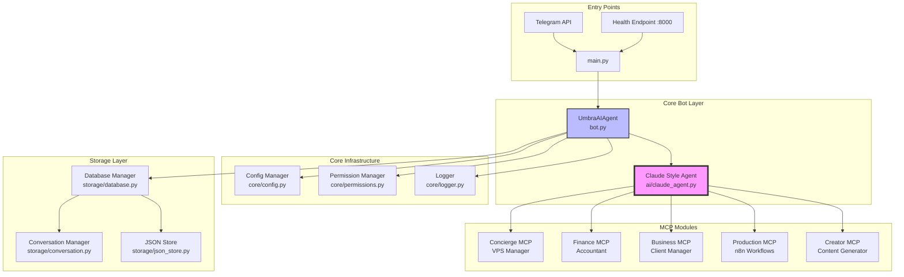
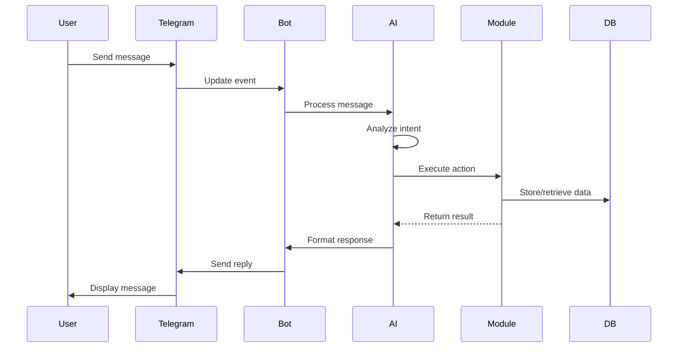
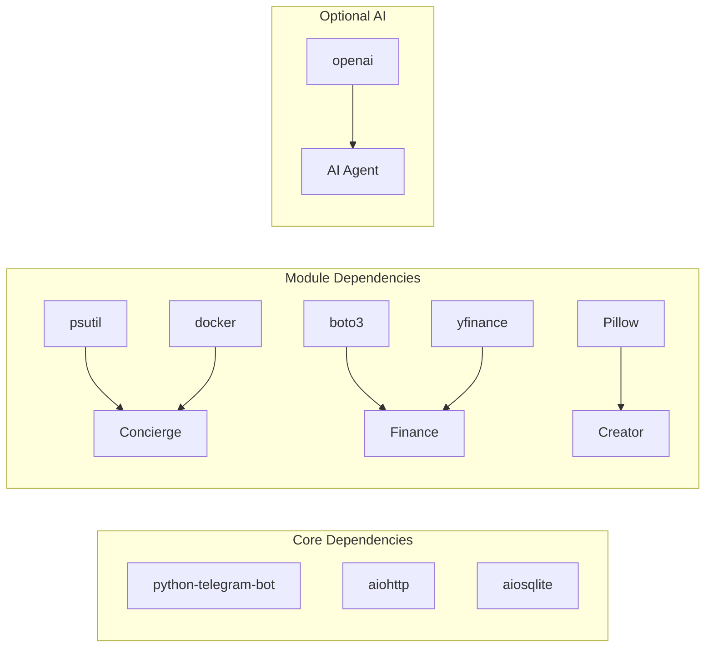

# ARCHITECTURE.md - Umbra MCP System Architecture

## System Overview

Umbra is a Claude Desktop-style AI assistant built as a Telegram bot with specialized MCP (Model Context Protocol) modules for VPS management, finance tracking, business operations, workflow automation, and content creation.

## Architecture Diagram



## Core Components

### 1. Entry Point (`main.py`)

**Purpose**: Production-ready launcher with health monitoring

**Responsibilities**:
- Environment setup and validation
- Health server initialization (port 8000)
- Bot lifecycle management
- Graceful shutdown handling

**Key Methods**:
```python
class UmbraLauncher:
    setup_environment()    # Configure environment variables
    validate_config()      # Validate required settings
    start_health_server()  # HTTP health endpoint
    start_bot()           # Initialize UmbraAIAgent
    shutdown()            # Clean shutdown
```

### 2. Bot Core (`umbra/bot.py`)

**Purpose**: Claude Desktop-style AI agent orchestrator

**Responsibilities**:
- Natural language processing
- Intelligent module selection
- Telegram interaction handling
- Conversation management

**Key Components**:
```python
class UmbraAIAgent:
    _init_systems()       # Core infrastructure
    _init_ai_agent()      # Claude-style AI
    _init_mcp_modules()   # Load MCP modules
    _handle_conversation() # Process messages
```

### 3. AI Agent (`umbra/ai/claude_agent.py`)

**Purpose**: Intelligent conversation handling with module orchestration

**Features**:
- Natural language understanding
- Context-aware module selection
- Multi-language support (EN, FR, PT)
- Fallback pattern matching when API unavailable

**Module Selection Logic**:
1. Analyze user intent from message
2. Identify required capabilities
3. Select appropriate MCP module(s)
4. Execute module functions
5. Format and return response

### 4. MCP Modules Architecture

Each module follows the MCP (Model Context Protocol) pattern:

```python
class ModuleMCP:
    def __init__(self, config, db_manager):
        self.config = config
        self.db = db_manager
        
    async def execute(self, action, params):
        # Module-specific logic
        return response
```

#### Module Capabilities

| Module | Primary Functions | Dependencies |
|--------|------------------|--------------|
| **Concierge** | System monitoring, Docker management, SSH execution | psutil, docker, subprocess |
| **Finance** | Expense tracking, budgets, reports, OCR | sqlite, boto3 (future R2) |
| **Business** | Client management, invoicing, resource allocation | Uses Concierge for VPS |
| **Production** | n8n workflow creation and deployment | n8n API integration |
| **Creator** | Content generation via multiple APIs | OpenAI, Stability, etc. |

## Data Flow

### Message Processing Sequence



### Internal Communication

**Message Envelope Structure**:
```json
{
    "user_id": "123456789",
    "action": "check_server",
    "params": {
        "metric": "cpu"
    },
    "context": {
        "language": "en",
        "is_admin": true
    },
    "timestamp": "2024-01-15T10:30:00Z"
}
```

## Storage Architecture

### Database Schema

**Core Tables**:
- `users`: User profiles and permissions
- `conversations`: Message history
- `finance_transactions`: Expense records
- `finance_budgets`: Budget settings
- `business_clients`: Client information
- `business_projects`: Project tracking

### Data Persistence

```yaml
Storage Layers:
  SQLite:
    - User data
    - Conversations
    - Financial records
    - Business data
    
  JSON Store:
    - Temporary caches
    - Module configs
    - Session data
    
  Future (R2/S3):
    - Receipt images
    - Document storage
    - Backup archives
```

## Security Architecture

### Permission Model

```python
Permission Levels:
  1. Unauthorized: No access
  2. User: Basic module access
  3. Admin: Full system control
  
Validation Flow:
  - Check user_id in ALLOWED_USER_IDS
  - Verify admin status for dangerous ops
  - Rate limit enforcement
  - Command confirmation for critical actions
```

### Environment Variables

**Required**:
- `TELEGRAM_BOT_TOKEN`: Bot authentication
- `ALLOWED_USER_IDS`: Authorized users (comma-separated)
- `ALLOWED_ADMIN_IDS`: Admin users

**Optional**:
- `OPENROUTER_API_KEY`: AI capabilities
- `N8N_API_URL/KEY`: Workflow automation
- Various API keys for content creation

## Module Dependencies

### Dependency Graph



## Deployment Architecture

### Container Structure

```dockerfile
FROM python:3.11-slim
├── System dependencies (gcc, docker)
├── Python requirements
├── Application code
├── Non-root user (umbra)
└── Health check endpoint
```

### Health Monitoring

**Endpoint**: `http://localhost:8000/health`

**Response**:
```json
{
    "status": "healthy",
    "service": "umbra-mcp",
    "version": "3.0.0",
    "modules": ["concierge", "finance", "business", "production", "creator"]
}
```

## Performance Considerations

### Optimization Strategies

1. **Async Operations**: All I/O operations are async
2. **Connection Pooling**: Database connections are pooled
3. **Caching**: Frequently accessed data is cached
4. **Rate Limiting**: 30 requests/minute default
5. **Lazy Loading**: Modules load on demand

### Scalability

- **Horizontal**: Multiple bot instances with shared database
- **Vertical**: Increase container resources
- **Module-based**: Individual modules can scale independently

## Error Handling

### Error Flow

```python
Error Handling Hierarchy:
  1. Module-level try/catch
  2. Bot-level error handler
  3. Global exception handler
  4. User-friendly error messages
  5. Detailed logging for debugging
```

### Logging Strategy

**Log Levels**:
- `ERROR`: Critical failures
- `WARNING`: Degraded functionality
- `INFO`: Normal operations
- `DEBUG`: Detailed diagnostics

## Future Architecture Enhancements

### Planned Improvements

1. **Cloudflare R2 Integration**
   - Document storage
   - Receipt OCR processing
   - Backup management

2. **Webhook Mode**
   - Native webhook support
   - Reduced latency
   - Better scalability

3. **Multi-tenant Support**
   - Organization management
   - Role-based access control
   - Isolated data spaces

4. **Advanced AI Features**
   - Multi-modal processing
   - Voice message support
   - Proactive suggestions

## Technical Decisions & Trade-offs

### Decisions

| Decision | Rationale | Trade-off |
|----------|-----------|-----------|
| SQLite database | Simplicity, no external dependencies | Limited concurrent writes |
| Polling vs Webhooks | Easier deployment, no public endpoint needed | Higher latency, more API calls |
| Modular architecture | Clean separation, easy to extend | Some code duplication |
| Python 3.11+ | Modern features, performance | Not compatible with older systems |

### Assumptions

1. Single-user or small team deployment
2. Moderate message volume (<1000/day)
3. VPS has Docker access (optional)
4. Internet connectivity for APIs

## Conclusion

The Umbra architecture provides a flexible, extensible foundation for a Claude Desktop-style AI assistant with specialized capabilities. The modular design allows for easy addition of new features while maintaining clean separation of concerns.
