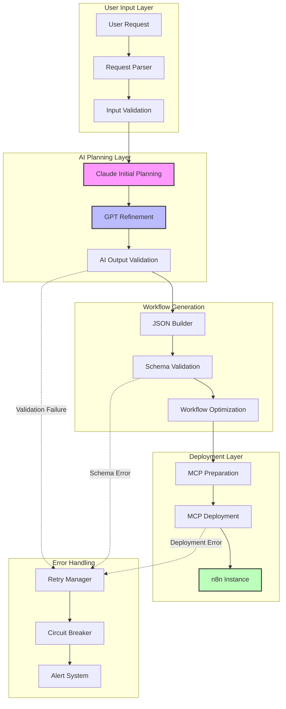

````markdown
# Production Pipeline - AI-Powered Workflow Creation

A comprehensive guide to the Production Module's robust workflow creation process, featuring multi-step AI planning with Claude and GPT, JSON validation, MCP deployment, and resilient error handling.

## Table of Contents

1. [Pipeline Overview](#pipeline-overview)
2. [Multi-Step AI Planning](#multi-step-ai-planning)
3. [JSON Building & Validation](#json-building--validation)
4. [MCP Deployment Process](#mcp-deployment-process)
5. [Retry Logic & Error Classification](#retry-logic--error-classification)
6. [Failure Alert Pathways](#failure-alert-pathways)
7. [Structured Result Objects](#structured-result-objects)
8. [Performance Optimization](#performance-optimization)

## Pipeline Overview

The Production Pipeline transforms natural language workflow descriptions into deployed n8n automation workflows through a sophisticated multi-stage process:



### Pipeline Stages

1. **Input Processing**: Parse and validate user workflow description
2. **AI Planning**: Multi-step refinement using Claude and GPT
3. **JSON Generation**: Build validated workflow specification
4. **Deployment**: Deploy via MCP to n8n instance
5. **Monitoring**: Track deployment status and health

## Multi-Step AI Planning

### Stage 1: Claude Initial Planning

**Purpose**: Generate comprehensive workflow specification from natural language

**Implementation**:
```typescript
interface ClaudeWorkflowPlanner {
  generateInitialWorkflow(
    description: string,
    context: WorkflowContext
  ): Promise<InitialWorkflowSpec>;
  
  analyzeRequirements(description: string): WorkflowRequirements;
  suggestOptimizations(workflow: WorkflowSpec): OptimizationSuggestion[];
}

interface WorkflowContext {
  userId: string;
  previousWorkflows: WorkflowSummary[];
  availableConnectors: ConnectorInfo[];
  environmentConstraints: ConstraintSet;
}
```

**Claude Prompt Template**:
```typescript
const CLAUDE_WORKFLOW_PROMPT = `
Create a comprehensive n8n workflow specification for: {description}

Context:
- User has experience with: {user_experience_level}
- Available connectors: {available_connectors}
- Performance requirements: {performance_requirements}

Generate a JSON workflow specification with:
1. Clear workflow name and description
2. Detailed node configuration
3. Proper error handling nodes
4. Data transformation steps
5. Output formatting

Requirements:
- Use best practices for n8n workflows
- Include retry logic for external API calls
- Add monitoring and logging nodes
- Optimize for performance and reliability
- Ensure proper data validation

Return only valid JSON in this format:
{
  "name": "workflow_name",
  "description": "detailed_description",
  "nodes": [...],
  "connections": [...],
  "settings": {...}
}
`;
```

**Example Claude Response**:
```json
{
  "name": "Customer Data Processing Pipeline",
  "description": "Automated pipeline to process customer data from CSV uploads, validate entries, enrich with external APIs, and store in database",
  "nodes": [
    {
      "id": "csv-trigger",
      "type": "trigger",
      "typeVersion": 1,
      "position": [240, 300],
      "parameters": {
        "path": "/webhook/csv-upload",
        "httpMethod": "POST",
        "responseMode": "onReceived"
      }
    },
    {
      "id": "csv-parser", 
      "type": "csv",
      "typeVersion": 1,
      "position": [440, 300],
      "parameters": {
        "operation": "csvToJson",
        "delimiter": ",",
        "includeEmptyColumns": false
      }
    },
    {
      "id": "data-validator",
      "type": "function",
      "typeVersion": 1,
      "position": [640, 300],
      "parameters": {
        "functionCode": "// Validate customer data entries\nconst validatedItems = [];\nfor (const item of $input.all()) {\n  if (item.json.email && item.json.name) {\n    validatedItems.push({\n      json: {\n        ...item.json,\n        validated: true,\n        timestamp: new Date().toISOString()\n      }\n    });\n  }\n}\nreturn validatedItems;"
      }
    }
  ],
  "connections": {
    "csv-trigger": {
      "main": [
        [
          {
            "node": "csv-parser",
            "type": "main",
            "index": 0
          }
        ]
      ]
    },
    "csv-parser": {
      "main": [
        [
          {
            "node": "data-validator", 
            "type": "main",
            "index": 0
          }
        ]
      ]
    }
  },
  "settings": {
    "timezone": "UTC",
    "saveExecutionProgress": true,
    "errorWorkflow": "error-handler-workflow"
  }
}
```

### Stage 2: GPT Refinement & Optimization

**Purpose**: Enhance workflow with advanced patterns and optimizations

**Implementation**:
```typescript
interface GPTWorkflowOptimizer {
  refineWorkflow(
    initialSpec: InitialWorkflowSpec,
    optimizationGoals: OptimizationGoal[]
  ): Promise<RefinedWorkflowSpec>;
  
  addErrorHandling(workflow: WorkflowSpec): WorkflowSpec;
  optimizePerformance(workflow: WorkflowSpec): WorkflowSpec;
  enhanceSecurity(workflow: WorkflowSpec): WorkflowSpec;
}

enum OptimizationGoal {
  PERFORMANCE = 'performance',
  RELIABILITY = 'reliability', 
  SECURITY = 'security',
  MAINTAINABILITY = 'maintainability',
  COST_EFFICIENCY = 'cost_efficiency'
}
```

**GPT Prompt Template**:
```typescript
const GPT_REFINEMENT_PROMPT = `
Analyze and optimize this n8n workflow specification:

{initial_workflow_json}

Optimization goals:
{optimization_goals}

Apply these improvements:
1. Add comprehensive error handling with retry logic
2. Implement circuit breaker patterns for external APIs
3. Add monitoring and logging nodes
4. Optimize data flow and reduce unnecessary operations
5. Enhance security with input validation and sanitization
6. Add workflow metadata and documentation

Return the enhanced workflow JSON with:
- Improved error handling nodes
- Performance optimizations
- Security enhancements
- Better data validation
- Monitoring integration

Maintain compatibility with n8n workflow format.
`;
```

**GPT Enhancement Example**:
```json
{
  "name": "Customer Data Processing Pipeline (Enhanced)",
  "description": "Production-ready automated pipeline with comprehensive error handling, monitoring, and security",
  "nodes": [
    {
      "id": "workflow-start",
      "type": "start",
      "typeVersion": 1,
      "position": [40, 300],
      "parameters": {}
    },
    {
      "id": "input-validator",
      "type": "function",
      "typeVersion": 1,
      "position": [240, 300],
      "parameters": {
        "functionCode": "// Enhanced input validation with security checks\nconst input = $input.first().json;\n\n// Validate file size (max 10MB)\nif (input.fileSize > 10 * 1024 * 1024) {\n  throw new Error('File size exceeds maximum limit of 10MB');\n}\n\n// Validate file type\nconst allowedTypes = ['text/csv', 'application/csv'];\nif (!allowedTypes.includes(input.mimeType)) {\n  throw new Error('Invalid file type. Only CSV files are allowed');\n}\n\n// Sanitize filename\nconst sanitizedFilename = input.filename.replace(/[^a-zA-Z0-9.-]/g, '_');\n\nreturn {\n  json: {\n    ...input,\n    filename: sanitizedFilename,\n    validated: true,\n    validationTimestamp: new Date().toISOString()\n  }\n};"
      }
    },
    {
      "id": "csv-parser-with-retry",
      "type": "csv",
      "typeVersion": 1,
      "position": [440, 300],
      "parameters": {
        "operation": "csvToJson",
        "delimiter": ",",
        "includeEmptyColumns": false
      },
      "retryOnFail": true,
      "maxTries": 3,
      "waitBetweenTries": 1000
    },
    {
      "id": "circuit-breaker-check",
      "type": "function", 
      "typeVersion": 1,
      "position": [640, 200],
      "parameters": {
        "functionCode": "// Circuit breaker for external API calls\nconst circuitState = await $workflow.getWorkflowStaticData('circuit_breaker_state') || 'closed';\nconst failureCount = await $workflow.getWorkflowStaticData('failure_count') || 0;\nconst lastFailure = await $workflow.getWorkflowStaticData('last_failure');\n\nconst now = Date.now();\nconst FAILURE_THRESHOLD = 5;\nconst TIMEOUT_DURATION = 60000; // 1 minute\n\nif (circuitState === 'open') {\n  if (lastFailure && (now - lastFailure) > TIMEOUT_DURATION) {\n    // Move to half-open state\n    await $workflow.setWorkflowStaticData('circuit_breaker_state', 'half_open');\n    return { json: { circuitState: 'half_open', canProceed: true } };\n  } else {\n    throw new Error('Circuit breaker is OPEN. External API calls are temporarily disabled.');\n  }\n}\n\nreturn { json: { circuitState, canProceed: true } };"
      }
    },
    {
      "id": "enhanced-data-validator",
      "type": "function",
      "typeVersion": 1, 
      "position": [640, 300],
      "parameters": {
        "functionCode": "// Enhanced data validation with detailed error reporting\nconst validatedItems = [];\nconst errors = [];\nlet validCount = 0;\nlet invalidCount = 0;\n\nfor (const [index, item] of $input.all().entries()) {\n  const row = item.json;\n  const rowErrors = [];\n  \n  // Email validation\n  if (!row.email || !/^[^\\s@]+@[^\\s@]+\\.[^\\s@]+$/.test(row.email)) {\n    rowErrors.push(`Invalid email format: ${row.email}`);\n  }\n  \n  // Name validation\n  if (!row.name || row.name.trim().length < 2) {\n    rowErrors.push('Name must be at least 2 characters');\n  }\n  \n  // Phone validation (optional)\n  if (row.phone && !/^[+]?[1-9][\\d\\s\\-()]{7,15}$/.test(row.phone)) {\n    rowErrors.push(`Invalid phone format: ${row.phone}`);\n  }\n  \n  if (rowErrors.length === 0) {\n    validatedItems.push({\n      json: {\n        ...row,\n        rowIndex: index + 1,\n        validated: true,\n        validationTimestamp: new Date().toISOString(),\n        processingId: `proc_${Date.now()}_${index}`\n      }\n    });\n    validCount++;\n  } else {\n    errors.push({\n      rowIndex: index + 1,\n      data: row,\n      errors: rowErrors\n    });\n    invalidCount++;\n  }\n}\n\n// Store validation results for monitoring\nawait $workflow.setWorkflowStaticData('last_validation', {\n  timestamp: new Date().toISOString(),\n  totalRows: $input.all().length,\n  validRows: validCount,\n  invalidRows: invalidCount,\n  errors: errors\n});\n\nif (validatedItems.length === 0) {\n  throw new Error(`No valid data found. Errors: ${JSON.stringify(errors)}`);\n}\n\nreturn validatedItems;"
      }
    },
    {
      "id": "monitoring-logger",
      "type": "http-request",
      "typeVersion": 1,
      "position": [840, 400],
      "parameters": {
        "url": "https://your-monitoring-service.com/api/log",
        "method": "POST",
        "headers": {
          "Authorization": "Bearer {{$env.MONITORING_API_KEY}}",
          "Content-Type": "application/json"
        },
        "body": {
          "workflowId": "{{$workflow.id}}",
          "executionId": "{{$execution.id}}",
          "timestamp": "{{new Date().toISOString()}}",
          "stage": "data_validation_complete",
          "metrics": {
            "processedRows": "{{$json.length}}",
            "validationDuration": "{{$execution.startedAt - Date.now()}}"
          }
        }
      },
      "continueOnFail": true
    }
  ],
  "connections": {
    "workflow-start": {
      "main": [
        [
          {
            "node": "input-validator",
            "type": "main",
            "index": 0
          }
        ]
      ]
    },
    "input-validator": {
      "main": [
        [
          {
            "node": "csv-parser-with-retry",
            "type": "main",
            "index": 0
          }
        ]
      ]
    },
    "csv-parser-with-retry": {
      "main": [
        [
          {
            "node": "circuit-breaker-check",
            "type": "main",
            "index": 0
          }
        ]
      ]
    },
    "circuit-breaker-check": {
      "main": [
        [
          {
            "node": "enhanced-data-validator",
            "type": "main",
            "index": 0
          }
        ]
      ]
    },
    "enhanced-data-validator": {
      "main": [
        [
          {
            "node": "monitoring-logger",
            "type": "main",
            "index": 0
          }
        ]
      ]
    }
  },
  "settings": {
    "timezone": "UTC",
    "saveExecutionProgress": true,
    "errorWorkflow": "error-handler-workflow",
    "executionTimeout": 3600,
    "callerPolicy": "workflowsFromSameOwner"
  }
}
```

## JSON Building & Validation

### Schema Validation Process

**n8n Workflow Schema**:
```typescript
interface WorkflowSchema {
  name: string;
  description?: string;
  nodes: WorkflowNode[];
  connections: WorkflowConnections;
  settings?: WorkflowSettings;
  staticData?: Record<string, any>;
}

interface WorkflowNode {
  id: string;
  type: string;
  typeVersion: number;
  position: [number, number];
  parameters: Record<string, any>;
  retryOnFail?: boolean;
  maxTries?: number;
  waitBetweenTries?: number;
  continueOnFail?: boolean;
}

interface WorkflowConnections {
  [nodeId: string]: {
    main?: Array<Array<{
      node: string;
      type: string;
      index: number;
    }>>;
  };
}
```

**Validation Implementation**:
```typescript
class WorkflowValidator {
  private schema: JSONSchema;
  
  constructor() {
    this.schema = this.loadN8NWorkflowSchema();
  }
  
  async validateWorkflow(workflow: any): Promise<ValidationResult> {
    const result: ValidationResult = {
      isValid: true,
      errors: [],
      warnings: []
    };
    
    try {
      // JSON Schema validation
      const schemaValidation = this.validateSchema(workflow);
      if (!schemaValidation.valid) {
        result.isValid = false;
        result.errors.push(...schemaValidation.errors);
      }
      
      // Business logic validation
      const businessValidation = this.validateBusinessLogic(workflow);
      if (!businessValidation.valid) {
        result.isValid = false;
        result.errors.push(...businessValidation.errors);
      }
      
      // Security validation
      const securityValidation = this.validateSecurity(workflow);
      result.warnings.push(...securityValidation.warnings);
      
      return result;
    } catch (error) {
      result.isValid = false;
      result.errors.push({
        type: 'VALIDATION_ERROR',
        message: `Validation failed: ${error.message}`,
        path: 'root'
      });
      return result;
    }
  }
  
  private validateBusinessLogic(workflow: WorkflowSchema): ValidationResult {
    const errors: ValidationError[] = [];
    
    // Check for orphaned nodes
    const referencedNodes = new Set<string>();
    Object.values(workflow.connections).forEach(connections => {
      connections.main?.forEach(connectionSet => {
        connectionSet.forEach(connection => {
          referencedNodes.add(connection.node);
        });
      });
    });
    
    const orphanedNodes = workflow.nodes.filter(node => 
      node.type !== 'trigger' && !referencedNodes.has(node.id)
    );
    
    if (orphanedNodes.length > 0) {
      errors.push({
        type: 'ORPHANED_NODES',
        message: `Found orphaned nodes: ${orphanedNodes.map(n => n.id).join(', ')}`,
        path: 'nodes'
      });
    }
    
    // Check for missing trigger nodes
    const triggerNodes = workflow.nodes.filter(node => 
      node.type === 'trigger' || node.type === 'webhook'
    );
    
    if (triggerNodes.length === 0) {
      errors.push({
        type: 'MISSING_TRIGGER',
        message: 'Workflow must have at least one trigger node',
        path: 'nodes'
      });
    }
    
    return {
      valid: errors.length === 0,
      errors,
      warnings: []
    };
  }
  
  private validateSecurity(workflow: WorkflowSchema): ValidationResult {
    const warnings: ValidationWarning[] = [];
    
    // Check for hardcoded secrets
    const workflowJson = JSON.stringify(workflow);
    const secretPatterns = [
      /(?:password|secret|key|token)\s*[:=]\s*['"][^'"]+['"]/gi,
      /(?:api[_-]?key|access[_-]?token)\s*[:=]\s*['"][^'"]+['"]/gi
    ];
    
    secretPatterns.forEach(pattern => {
      const matches = workflowJson.match(pattern);
      if (matches) {
        warnings.push({
          type: 'HARDCODED_SECRET',
          message: 'Potential hardcoded secret detected. Use environment variables instead.',
          path: 'parameters'
        });
      }
    });
    
    return {
      valid: true,
      errors: [],
      warnings
    };
  }
}
```

### Workflow Optimization Engine

**Performance Optimizations**:
```typescript
class WorkflowOptimizer {
  optimize(workflow: WorkflowSchema): OptimizedWorkflow {
    let optimized = { ...workflow };
    
    // Apply optimization strategies
    optimized = this.optimizeDataFlow(optimized);
    optimized = this.addErrorHandling(optimized);
    optimized = this.optimizeNodePositioning(optimized);
    optimized = this.addMonitoring(optimized);
    
    return {
      workflow: optimized,
      optimizations: this.getAppliedOptimizations()
    };
  }
  
  private optimizeDataFlow(workflow: WorkflowSchema): WorkflowSchema {
    // Remove unnecessary data transformations
    // Merge compatible operations
    // Optimize data passing between nodes
    
    const optimizedNodes = workflow.nodes.map(node => {
      if (node.type === 'function' && this.isSimpleTransformation(node)) {
        // Merge simple transformations with previous node
        return this.mergeWithPreviousNode(node, workflow);
      }
      return node;
    });
    
    return {
      ...workflow,
      nodes: optimizedNodes
    };
  }
  
  private addErrorHandling(workflow: WorkflowSchema): WorkflowSchema {
    const errorHandlingNodes: WorkflowNode[] = [];
    const updatedConnections = { ...workflow.connections };
    
    // Add error handling for external API calls
    workflow.nodes.forEach(node => {
      if (this.isExternalAPINode(node)) {
        const errorHandlerNode: WorkflowNode = {
          id: `${node.id}-error-handler`,
          type: 'function',
          typeVersion: 1,
          position: [node.position[0] + 200, node.position[1] + 100],
          parameters: {
            functionCode: this.generateErrorHandlerCode(node)
          }
        };
        
        errorHandlingNodes.push(errorHandlerNode);
        
        // Update connections to include error handling
        if (!updatedConnections[node.id]) {
          updatedConnections[node.id] = {};
        }
        updatedConnections[node.id].error = [[{
          node: errorHandlerNode.id,
          type: 'main',
          index: 0
        }]];
      }
    });
    
    return {
      ...workflow,
      nodes: [...workflow.nodes, ...errorHandlingNodes],
      connections: updatedConnections
    };
  }
}
```

## MCP Deployment Process

### MCP Protocol Integration

**MCP Client Configuration**:
```typescript
interface MCPClient {
  connect(endpoint: string, auth: MCPAuth): Promise<MCPConnection>;
  deployWorkflow(request: MCPDeploymentRequest): Promise<MCPDeploymentResponse>;
  getWorkflowStatus(workflowId: string): Promise<MCPWorkflowStatus>;
  deleteWorkflow(workflowId: string): Promise<MCPDeleteResponse>;
}

interface MCPDeploymentRequest {
  workflowId: string;
  specification: WorkflowSchema;
  environment: 'development' | 'staging' | 'production';
  metadata: DeploymentMetadata;
}

interface DeploymentMetadata {
  createdBy: string;
  description: string;
  tags: string[];
  schedulingOptions?: SchedulingOptions;
  resourceLimits?: ResourceLimits;
}
```

**Deployment Implementation**:
```typescript
class MCPDeploymentManager {
  private client: MCPClient;
  private retryManager: RetryManager;
  private circuitBreaker: CircuitBreaker;
  
  constructor(config: MCPConfig) {
    this.client = new MCPClient(config);
    this.retryManager = new RetryManager(config.retryConfig);
    this.circuitBreaker = new CircuitBreaker(config.circuitBreakerConfig);
  }
  
  async deployWorkflow(
    workflow: WorkflowSchema,
    options: DeploymentOptions
  ): Promise<DeploymentResult> {
    return this.circuitBreaker.execute(async () => {
      return this.retryManager.execute(async () => {
        const deploymentRequest: MCPDeploymentRequest = {
          workflowId: this.generateWorkflowId(workflow),
          specification: workflow,
          environment: options.environment,
          metadata: {
            createdBy: options.userId,
            description: workflow.description || '',
            tags: options.tags || [],
            schedulingOptions: options.scheduling,
            resourceLimits: options.resourceLimits
          }
        };
        
        // Pre-deployment validation
        const validationResult = await this.validateDeployment(deploymentRequest);
        if (!validationResult.valid) {
          throw new DeploymentError('VALIDATION_FAILED', validationResult.errors);
        }
        
        // Deploy to MCP
        const response = await this.client.deployWorkflow(deploymentRequest);
        
        // Post-deployment verification
        await this.verifyDeployment(response.workflowId);
        
        return {
          workflowId: response.workflowId,
          status: 'deployed',
          endpoint: response.endpoint,
          metadata: response.metadata,
          deploymentTime: new Date()
        };
      });
    });
  }
  
  private async validateDeployment(
    request: MCPDeploymentRequest
  ): Promise<ValidationResult> {
    const validations = await Promise.all([
      this.validateWorkflowResources(request.specification),
      this.validateEnvironmentPermissions(request.environment),
      this.validateResourceQuotas(request.metadata.resourceLimits)
    ]);
    
    const errors = validations.flatMap(v => v.errors);
    const warnings = validations.flatMap(v => v.warnings);
    
    return {
      valid: errors.length === 0,
      errors,
      warnings
    };
  }
  
  private async verifyDeployment(workflowId: string): Promise<void> {
    const maxAttempts = 30; // 30 seconds timeout
    let attempts = 0;
    
    while (attempts < maxAttempts) {
      const status = await this.client.getWorkflowStatus(workflowId);
      
      if (status.state === 'active') {
        return; // Deployment successful
      }
      
      if (status.state === 'failed') {
        throw new DeploymentError('DEPLOYMENT_FAILED', status.errorMessage);
      }
      
      await this.sleep(1000); // Wait 1 second
      attempts++;
    }
    
    throw new DeploymentError('DEPLOYMENT_TIMEOUT', 'Deployment verification timed out');
  }
}
```

### Environment-Specific Configurations

**Development Environment**:
```typescript
const DEVELOPMENT_CONFIG: MCPEnvironmentConfig = {
  endpoint: 'https://dev-mcp.example.com',
  resourceLimits: {
    maxNodes: 50,
    maxExecutionTime: 300, // 5 minutes
    maxMemory: '512MB',
    maxConcurrentExecutions: 5
  },
  networking: {
    allowedOutbound: ['api.openai.com', 'api.anthropic.com'],
    allowedInbound: ['webhook'],
    rateLimit: {
      requestsPerMinute: 60,
      burstLimit: 10
    }
  },
  monitoring: {
    enableDetailedLogging: true,
    enableMetrics: true,
    retentionDays: 7
  }
};
```

**Production Environment**:
```typescript
const PRODUCTION_CONFIG: MCPEnvironmentConfig = {
  endpoint: 'https://prod-mcp.example.com',
  resourceLimits: {
    maxNodes: 200,
    maxExecutionTime: 1800, // 30 minutes
    maxMemory: '2GB',
    maxConcurrentExecutions: 20
  },
  networking: {
    allowedOutbound: ['*'], // More permissive in production
    allowedInbound: ['webhook', 'api'],
    rateLimit: {
      requestsPerMinute: 300,
      burstLimit: 50
    }
  },
  monitoring: {
    enableDetailedLogging: false, // Performance optimization
    enableMetrics: true,
    retentionDays: 30
  },
  security: {
    enableEncryption: true,
    requireTLS: true,
    enableAuditLogging: true
  }
};
```

## Retry Logic & Error Classification

### Error Classification System

**Error Categories**:
```typescript
enum ErrorCategory {
  // Retryable errors
  NETWORK_ERROR = 'network_error',
  RATE_LIMIT = 'rate_limit',
  SERVICE_UNAVAILABLE = 'service_unavailable',
  TIMEOUT = 'timeout',
  
  // Non-retryable errors
  AUTHENTICATION_ERROR = 'auth_error',
  VALIDATION_ERROR = 'validation_error',
  QUOTA_EXCEEDED = 'quota_exceeded',
  INVALID_REQUEST = 'invalid_request',
  
  // Technical vs Business errors
  TECHNICAL_ERROR = 'technical_error',
  BUSINESS_ERROR = 'business_error'
}

interface ErrorClassification {
  category: ErrorCategory;
  retryable: boolean;
  exponentialBackoff: boolean;
  maxRetries: number;
  baseDelay: number;
  maxDelay: number;
}
```

**Error Classifier Implementation**:
```typescript
class ErrorClassifier {
  private classifications: Map<string, ErrorClassification>;
  
  constructor() {
    this.classifications = new Map([
      ['ECONNRESET', {
        category: ErrorCategory.NETWORK_ERROR,
        retryable: true,
        exponentialBackoff: true,
        maxRetries: 3,
        baseDelay: 1000,
        maxDelay: 30000
      }],
      ['RATE_LIMIT_EXCEEDED', {
        category: ErrorCategory.RATE_LIMIT,
        retryable: true,
        exponentialBackoff: false,
        maxRetries: 5,
        baseDelay: 5000,
        maxDelay: 60000
      }],
      ['INVALID_JSON_SCHEMA', {
        category: ErrorCategory.VALIDATION_ERROR,
        retryable: false,
        exponentialBackoff: false,
        maxRetries: 0,
        baseDelay: 0,
        maxDelay: 0
      }]
    ]);
  }
  
  classify(error: Error): ErrorClassification {
    // Check for known error patterns
    for (const [pattern, classification] of this.classifications) {
      if (error.message.includes(pattern) || error.name === pattern) {
        return classification;
      }
    }
    
    // HTTP status code classification
    if (error instanceof HTTPError) {
      return this.classifyHTTPError(error);
    }
    
    // Default classification for unknown errors
    return {
      category: ErrorCategory.TECHNICAL_ERROR,
      retryable: true,
      exponentialBackoff: true,
      maxRetries: 2,
      baseDelay: 1000,
      maxDelay: 10000
    };
  }
  
  private classifyHTTPError(error: HTTPError): ErrorClassification {
    const statusCode = error.statusCode;
    
    if (statusCode >= 500) {
      // Server errors - generally retryable
      return {
        category: ErrorCategory.SERVICE_UNAVAILABLE,
        retryable: true,
        exponentialBackoff: true,
        maxRetries: 3,
        baseDelay: 2000,
        maxDelay: 30000
      };
    }
    
    if (statusCode === 429) {
      // Rate limiting
      return {
        category: ErrorCategory.RATE_LIMIT,
        retryable: true,
        exponentialBackoff: false,
        maxRetries: 5,
        baseDelay: parseInt(error.headers['retry-after']) * 1000 || 5000,
        maxDelay: 60000
      };
    }
    
    if (statusCode >= 400 && statusCode < 500) {
      // Client errors - generally not retryable
      return {
        category: ErrorCategory.INVALID_REQUEST,
        retryable: false,
        exponentialBackoff: false,
        maxRetries: 0,
        baseDelay: 0,
        maxDelay: 0
      };
    }
    
    // Fallback
    return {
      category: ErrorCategory.TECHNICAL_ERROR,
      retryable: false,
      exponentialBackoff: false,
      maxRetries: 0,
      baseDelay: 0,
      maxDelay: 0
    };
  }
}
```

### Exponential Backoff Implementation

**Retry Manager**:
```typescript
class RetryManager {
  private errorClassifier: ErrorClassifier;
  private logger: Logger;
  
  constructor(config: RetryConfig) {
    this.errorClassifier = new ErrorClassifier();
    this.logger = new Logger('RetryManager');
  }
  
  async execute<T>(
    operation: () => Promise<T>,
    context: RetryContext = {}
  ): Promise<T> {
    let lastError: Error;
    let attempt = 0;
    
    while (attempt <= (context.maxRetries || 3)) {
      try {
        const result = await operation();
        
        if (attempt > 0) {
          this.logger.info('Operation succeeded after retry', {
            attempt,
            operation: context.operationName
          });
        }
        
        return result;
      } catch (error) {
        lastError = error;
        attempt++;
        
        const classification = this.errorClassifier.classify(error);
        
        if (!classification.retryable || attempt > classification.maxRetries) {
          this.logger.error('Operation failed - not retryable', {
            error: error.message,
            attempt,
            classification: classification.category
          });
          throw error;
        }
        
        const delay = this.calculateDelay(
          attempt,
          classification.baseDelay,
          classification.maxDelay,
          classification.exponentialBackoff
        );
        
        this.logger.warn('Operation failed - retrying', {
          error: error.message,
          attempt,
          nextRetryIn: delay,
          classification: classification.category
        });
        
        await this.sleep(delay);
      }
    }
    
    throw lastError;
  }
  
  private calculateDelay(
    attempt: number,
    baseDelay: number,
    maxDelay: number,
    exponential: boolean
  ): number {
    if (!exponential) {
      return Math.min(baseDelay, maxDelay);
    }
    
    const exponentialDelay = baseDelay * Math.pow(2, attempt - 1);
    const jitteredDelay = exponentialDelay * (0.5 + Math.random() * 0.5); // Add jitter
    
    return Math.min(jitteredDelay, maxDelay);
  }
  
  private sleep(ms: number): Promise<void> {
    return new Promise(resolve => setTimeout(resolve, ms));
  }
}
```

### Functional vs Technical Error Classification

**Business Logic Errors (Functional)**:
```typescript
class FunctionalErrorHandler {
  handleBusinessError(error: BusinessError): ErrorResponse {
    switch (error.type) {
      case 'INVALID_WORKFLOW_SPECIFICATION':
        return {
          category: 'functional',
          userMessage: 'The workflow specification contains invalid configurations. Please review the requirements and try again.',
          technicalDetails: error.details,
          suggestedActions: [
            'Review the workflow description for clarity',
            'Check if all required components are specified',
            'Validate input parameters'
          ],
          retryable: true, // User can fix and retry
          retryStrategy: 'user_intervention'
        };
        
      case 'INSUFFICIENT_PERMISSIONS':
        return {
          category: 'functional', 
          userMessage: 'You do not have sufficient permissions to deploy workflows to the selected environment.',
          technicalDetails: error.details,
          suggestedActions: [
            'Request access from your administrator',
            'Try deploying to a development environment',
            'Contact support for assistance'
          ],
          retryable: false,
          retryStrategy: 'none'
        };
        
      case 'QUOTA_EXCEEDED':
        return {
          category: 'functional',
          userMessage: 'Your account has reached the maximum number of workflows. Please remove unused workflows or upgrade your plan.',
          technicalDetails: error.details,
          suggestedActions: [
            'Delete unused workflows',
            'Upgrade to a higher plan',
            'Contact support for quota increase'
          ],
          retryable: false,
          retryStrategy: 'none'
        };
    }
  }
}
```

**Technical Errors (System)**:
```typescript
class TechnicalErrorHandler {
  handleTechnicalError(error: TechnicalError): ErrorResponse {
    switch (error.type) {
      case 'MCP_CONNECTION_FAILED':
        return {
          category: 'technical',
          userMessage: 'Unable to connect to the deployment service. Please try again in a few moments.',
          technicalDetails: error.details,
          suggestedActions: [],
          retryable: true,
          retryStrategy: 'exponential_backoff',
          retryConfig: {
            maxRetries: 3,
            baseDelay: 2000,
            maxDelay: 30000
          }
        };
        
      case 'JSON_VALIDATION_TIMEOUT':
        return {
          category: 'technical',
          userMessage: 'The workflow validation process timed out. Please try with a simpler workflow.',
          technicalDetails: error.details,
          suggestedActions: [
            'Simplify the workflow description',
            'Break complex workflows into smaller parts'
          ],
          retryable: true,
          retryStrategy: 'immediate',
          retryConfig: {
            maxRetries: 1,
            baseDelay: 0,
            maxDelay: 0
          }
        };
        
      case 'AI_PROVIDER_RATE_LIMIT':
        return {
          category: 'technical',
          userMessage: 'Our AI services are currently experiencing high demand. Please try again in a few minutes.',
          technicalDetails: error.details,
          suggestedActions: [],
          retryable: true,
          retryStrategy: 'fixed_delay',
          retryConfig: {
            maxRetries: 5,
            baseDelay: 30000, // 30 seconds
            maxDelay: 300000  // 5 minutes
          }
        };
    }
  }
}
```

## Failure Alert Pathways

### Alert Configuration

**Alert Severity Levels**:
```typescript
enum AlertSeverity {
  LOW = 'low',
  MEDIUM = 'medium', 
  HIGH = 'high',
  CRITICAL = 'critical'
}

interface AlertConfig {
  severity: AlertSeverity;
  channels: AlertChannel[];
  escalation: EscalationPolicy;
  throttling: ThrottlingConfig;
}

interface AlertChannel {
  type: 'email' | 'slack' | 'webhook' | 'telegram';
  config: ChannelConfig;
  enabled: boolean;
}
```

**Alert Triggers**:
```typescript
const ALERT_TRIGGERS: Record<string, AlertConfig> = {
  'workflow_deployment_failed': {
    severity: AlertSeverity.HIGH,
    channels: [
      {
        type: 'slack',
        config: { channel: '#production-alerts', webhook: process.env.SLACK_WEBHOOK },
        enabled: true
      },
      {
        type: 'email',
        config: { recipients: ['dev-team@company.com'] },
        enabled: true
      }
    ],
    escalation: {
      timeoutMinutes: 15,
      escalateToManagement: true
    },
    throttling: {
      windowMinutes: 5,
      maxAlertsInWindow: 3
    }
  },
  
  'ai_provider_circuit_breaker_open': {
    severity: AlertSeverity.CRITICAL,
    channels: [
      {
        type: 'slack',
        config: { channel: '#incidents', webhook: process.env.SLACK_WEBHOOK },
        enabled: true
      },
      {
        type: 'telegram',
        config: { chatId: process.env.ADMIN_CHAT_ID, botToken: process.env.ALERT_BOT_TOKEN },
        enabled: true
      }
    ],
    escalation: {
      timeoutMinutes: 5,
      escalateToManagement: true,
      escalateToOncall: true
    },
    throttling: {
      windowMinutes: 1,
      maxAlertsInWindow: 1
    }
  },
  
  'workflow_validation_high_failure_rate': {
    severity: AlertSeverity.MEDIUM,
    channels: [
      {
        type: 'email',
        config: { recipients: ['product-team@company.com'] },
        enabled: true
      }
    ],
    escalation: {
      timeoutMinutes: 60,
      escalateToManagement: false
    },
    throttling: {
      windowMinutes: 60,
      maxAlertsInWindow: 1
    }
  }
};
```

### Alert Manager Implementation

**Alert Manager**:
```typescript
class AlertManager {
  private channels: Map<string, AlertChannel>;
  private throttleTracker: Map<string, ThrottleState>;
  private logger: Logger;
  
  constructor(config: AlertManagerConfig) {
    this.channels = new Map();
    this.throttleTracker = new Map();
    this.logger = new Logger('AlertManager');
    
    this.initializeChannels(config.channels);
  }
  
  async sendAlert(alertType: string, context: AlertContext): Promise<void> {
    const config = ALERT_TRIGGERS[alertType];
    if (!config) {
      this.logger.warn('Unknown alert type', { alertType });
      return;
    }
    
    // Check throttling
    if (this.isThrottled(alertType, config.throttling)) {
      this.logger.info('Alert throttled', { alertType });
      return;
    }
    
    const alert: Alert = {
      id: this.generateAlertId(),
      type: alertType,
      severity: config.severity,
      timestamp: new Date(),
      context,
      message: this.formatAlertMessage(alertType, context)
    };
    
    // Send to all configured channels
    const promises = config.channels
      .filter(channel => channel.enabled)
      .map(channel => this.sendToChannel(alert, channel));
    
    await Promise.allSettled(promises);
    
    // Update throttle state
    this.updateThrottleState(alertType);
    
    // Start escalation timer if configured
    if (config.escalation) {
      this.startEscalationTimer(alert, config.escalation);
    }
  }
  
  private async sendToChannel(alert: Alert, channel: AlertChannel): Promise<void> {
    try {
      const channelHandler = this.channels.get(channel.type);
      if (!channelHandler) {
        throw new Error(`No handler for channel type: ${channel.type}`);
      }
      
      await channelHandler.send(alert, channel.config);
      
      this.logger.info('Alert sent successfully', {
        alertId: alert.id,
        channel: channel.type,
        severity: alert.severity
      });
    } catch (error) {
      this.logger.error('Failed to send alert', {
        alertId: alert.id,
        channel: channel.type,
        error: error.message
      });
    }
  }
  
  private formatAlertMessage(alertType: string, context: AlertContext): string {
    switch (alertType) {
      case 'workflow_deployment_failed':
        return `🚨 Workflow Deployment Failed
        
**Workflow**: ${context.workflowName || 'Unknown'}
**User**: ${context.userId || 'Unknown'}
**Error**: ${context.error || 'No error details'}
**Timestamp**: ${new Date().toISOString()}

**Next Steps**:
1. Check workflow logs for detailed error information
2. Validate workflow specification
3. Verify MCP service status
4. Contact on-call engineer if issue persists`;

      case 'ai_provider_circuit_breaker_open':
        return `🔴 CRITICAL: AI Provider Circuit Breaker Open
        
**Provider**: ${context.provider || 'Unknown'}
**Failure Count**: ${context.failureCount || 'Unknown'}
**Last Error**: ${context.lastError || 'No error details'}
**Impact**: Workflow creation temporarily disabled

**Immediate Actions Required**:
1. Check provider status page
2. Verify API credentials
3. Consider switching to backup provider
4. Monitor for service recovery`;

      default:
        return `Alert: ${alertType}\n\nContext: ${JSON.stringify(context, null, 2)}`;
    }
  }
}
```

### Escalation Procedures

**Escalation Policy**:
```typescript
interface EscalationPolicy {
  timeoutMinutes: number;
  escalateToManagement: boolean;
  escalateToOncall?: boolean;
  customEscalation?: EscalationStep[];
}

interface EscalationStep {
  delayMinutes: number;
  action: 'notify_manager' | 'notify_oncall' | 'create_incident' | 'custom_webhook';
  config: EscalationConfig;
}

class EscalationManager {
  private activeEscalations: Map<string, EscalationTimer>;
  
  async startEscalation(alert: Alert, policy: EscalationPolicy): Promise<void> {
    const escalationId = `${alert.id}-escalation`;
    
    const timer = setTimeout(async () => {
      await this.executeEscalation(alert, policy);
    }, policy.timeoutMinutes * 60 * 1000);
    
    this.activeEscalations.set(escalationId, {
      alertId: alert.id,
      timer,
      policy,
      startTime: new Date()
    });
  }
  
  private async executeEscalation(alert: Alert, policy: EscalationPolicy): Promise<void> {
    if (policy.escalateToOncall) {
      await this.notifyOncall(alert);
    }
    
    if (policy.escalateToManagement) {
      await this.notifyManagement(alert);
    }
    
    if (policy.customEscalation) {
      for (const step of policy.customEscalation) {
        setTimeout(async () => {
          await this.executeEscalationStep(alert, step);
        }, step.delayMinutes * 60 * 1000);
      }
    }
  }
}
```

## Structured Result Objects

### Result Object Schema

**Base Result Interface**:
```typescript
interface WorkflowCreationResult {
  requestId: string;
  status: 'success' | 'partial_success' | 'failure';
  workflowId?: string;
  stages: StageResult[];
  metadata: ResultMetadata;
  errors?: ErrorDetail[];
  warnings?: WarningDetail[];
}

interface StageResult {
  stage: PipelineStage;
  status: 'completed' | 'failed' | 'skipped';
  duration: number; // milliseconds
  output?: any;
  error?: ErrorDetail;
  retryCount?: number;
}

enum PipelineStage {
  INPUT_VALIDATION = 'input_validation',
  CLAUDE_PLANNING = 'claude_planning',
  GPT_REFINEMENT = 'gpt_refinement',
  JSON_VALIDATION = 'json_validation',
  WORKFLOW_OPTIMIZATION = 'workflow_optimization',
  MCP_DEPLOYMENT = 'mcp_deployment',
  DEPLOYMENT_VERIFICATION = 'deployment_verification'
}
```

**Success Result Example**:
```typescript
const successResult: WorkflowCreationResult = {
  requestId: 'req_20241230_123456789',
  status: 'success',
  workflowId: 'wf_customer_data_pipeline_20241230',
  stages: [
    {
      stage: PipelineStage.INPUT_VALIDATION,
      status: 'completed',
      duration: 150,
      output: {
        validatedInput: 'Customer data processing pipeline with CSV upload validation',
        detectedLanguage: 'english',
        complexityScore: 0.7
      }
    },
    {
      stage: PipelineStage.CLAUDE_PLANNING,
      status: 'completed',
      duration: 3240,
      output: {
        generatedNodes: 8,
        estimatedComplexity: 'medium',
        suggestedOptimizations: ['add_error_handling', 'optimize_data_flow']
      }
    },
    {
      stage: PipelineStage.GPT_REFINEMENT,
      status: 'completed',
      duration: 2180,
      output: {
        optimizationsApplied: ['error_handling', 'circuit_breaker', 'monitoring'],
        performanceImprovements: ['merged_transformations', 'reduced_api_calls'],
        securityEnhancements: ['input_sanitization', 'secret_detection']
      }
    },
    {
      stage: PipelineStage.JSON_VALIDATION,
      status: 'completed',
      duration: 89,
      output: {
        schemaValid: true,
        businessLogicValid: true,
        securityWarnings: 0
      }
    },
    {
      stage: PipelineStage.MCP_DEPLOYMENT,
      status: 'completed',
      duration: 4560,
      output: {
        deploymentId: 'dep_20241230_123456789',
        endpoint: 'https://workflows.company.com/wf_customer_data_pipeline_20241230',
        environment: 'production'
      }
    }
  ],
  metadata: {
    totalDuration: 10219,
    userId: 'user_123',
    language: 'en',
    environment: 'production',
    aiTokensUsed: {
      claude: 1240,
      gpt: 890
    },
    costs: {
      aiProcessing: 0.0456,
      deployment: 0.01,
      total: 0.0556
    }
  }
};
```

**Failure Result Example**:
```typescript
const failureResult: WorkflowCreationResult = {
  requestId: 'req_20241230_987654321',
  status: 'failure',
  stages: [
    {
      stage: PipelineStage.INPUT_VALIDATION,
      status: 'completed',
      duration: 120
    },
    {
      stage: PipelineStage.CLAUDE_PLANNING,
      status: 'failed',
      duration: 8000,
      error: {
        type: 'AI_PROVIDER_ERROR',
        code: 'RATE_LIMIT_EXCEEDED',
        message: 'Claude API rate limit exceeded',
        retryable: true,
        retryAfter: 60000
      },
      retryCount: 3
    },
    {
      stage: PipelineStage.GPT_REFINEMENT,
      status: 'skipped'
    }
  ],
  metadata: {
    totalDuration: 8120,
    userId: 'user_456',
    language: 'en',
    environment: 'production',
    failurePoint: PipelineStage.CLAUDE_PLANNING
  },
  errors: [
    {
      type: 'AI_PROVIDER_ERROR',
      code: 'RATE_LIMIT_EXCEEDED',
      message: 'Unable to generate workflow specification due to API rate limiting',
      stage: PipelineStage.CLAUDE_PLANNING,
      retryable: true,
      userMessage: 'Our AI services are currently experiencing high demand. Please try again in a minute.',
      suggestedActions: [
        'Wait 1 minute before retrying',
        'Try simplifying your workflow description',
        'Contact support if the issue persists'
      ]
    }
  ]
};
```

### Metadata Collection

**Performance Metrics**:
```typescript
interface PerformanceMetrics {
  stageDurations: Record<PipelineStage, number>;
  totalDuration: number;
  queueTime?: number;
  aiProcessingTime: number;
  deploymentTime: number;
  retryOverhead: number;
}

interface ResourceUsage {
  aiTokensUsed: {
    claude: number;
    gpt: number;
  };
  apiCallsCount: number;
  memoryPeakUsage: number;
  cpuTimeUsed: number;
}

interface CostMetrics {
  aiProcessing: number;
  deployment: number;
  storage: number;
  networking: number;
  total: number;
  currency: string;
}
```

**Context Information**:
```typescript
interface WorkflowContext {
  originalDescription: string;
  userId: string;
  sessionId: string;
  clientInfo: {
    userAgent?: string;
    ipAddress?: string;
    platform?: string;
  };
  businessContext: {
    department?: string;
    project?: string;
    priority: 'low' | 'medium' | 'high';
  };
}
```

## Performance Optimization

### Caching Strategies

**AI Response Caching**:
```typescript
interface AICache {
  getWorkflowPlan(descriptionHash: string): Promise<CachedWorkflow | null>;
  storeWorkflowPlan(descriptionHash: string, workflow: WorkflowSpec, ttl: number): Promise<void>;
  invalidatePattern(pattern: string): Promise<void>;
}

class RedisAICache implements AICache {
  private redis: Redis;
  private defaultTTL = 3600; // 1 hour
  
  async getWorkflowPlan(descriptionHash: string): Promise<CachedWorkflow | null> {
    const cached = await this.redis.get(`workflow:${descriptionHash}`);
    if (!cached) return null;
    
    const parsed = JSON.parse(cached);
    
    // Check if cache is still valid
    if (Date.now() - parsed.timestamp > parsed.ttl * 1000) {
      await this.redis.del(`workflow:${descriptionHash}`);
      return null;
    }
    
    return parsed.workflow;
  }
  
  async storeWorkflowPlan(
    descriptionHash: string,
    workflow: WorkflowSpec,
    ttl: number = this.defaultTTL
  ): Promise<void> {
    const cacheEntry = {
      workflow,
      timestamp: Date.now(),
      ttl
    };
    
    await this.redis.setex(
      `workflow:${descriptionHash}`,
      ttl,
      JSON.stringify(cacheEntry)
    );
  }
}
```

### Parallel Processing

**Concurrent Stage Execution**:
```typescript
class ParallelPipelineExecutor {
  async executeStages(
    workflow: WorkflowSpec,
    stages: PipelineStage[]
  ): Promise<StageResult[]> {
    const results: StageResult[] = [];
    
    // Group independent stages for parallel execution
    const stageGroups = this.groupIndependentStages(stages);
    
    for (const group of stageGroups) {
      const groupPromises = group.map(stage => this.executeStage(stage, workflow));
      const groupResults = await Promise.allSettled(groupPromises);
      
      // Process results and handle failures
      for (let i = 0; i < groupResults.length; i++) {
        const result = groupResults[i];
        if (result.status === 'fulfilled') {
          results.push(result.value);
        } else {
          results.push({
            stage: group[i],
            status: 'failed',
            duration: 0,
            error: {
              type: 'STAGE_EXECUTION_ERROR',
              code: 'PARALLEL_EXECUTION_FAILED',
              message: result.reason.message
            }
          });
        }
      }
      
      // Stop pipeline if critical stage failed
      if (this.hasCriticalFailure(results)) {
        break;
      }
    }
    
    return results;
  }
  
  private groupIndependentStages(stages: PipelineStage[]): PipelineStage[][] {
    // Simple grouping logic - can be enhanced with dependency analysis
    return [
      [PipelineStage.INPUT_VALIDATION],
      [PipelineStage.CLAUDE_PLANNING, PipelineStage.JSON_VALIDATION], // Can run in parallel
      [PipelineStage.GPT_REFINEMENT],
      [PipelineStage.WORKFLOW_OPTIMIZATION, PipelineStage.MCP_DEPLOYMENT]
    ];
  }
}
```

### Resource Management

**Connection Pooling**:
```typescript
class ConnectionManager {
  private aiProviderPools: Map<string, ConnectionPool>;
  private mcpConnectionPool: ConnectionPool;
  
  constructor(config: ConnectionConfig) {
    this.aiProviderPools = new Map();
    this.initializePools(config);
  }
  
  async getAIConnection(provider: string): Promise<AIConnection> {
    const pool = this.aiProviderPools.get(provider);
    if (!pool) {
      throw new Error(`No connection pool for provider: ${provider}`);
    }
    
    return pool.acquire();
  }
  
  async getMCPConnection(): Promise<MCPConnection> {
    return this.mcpConnectionPool.acquire();
  }
  
  private initializePools(config: ConnectionConfig): void {
    // AI Provider pools
    config.aiProviders.forEach(provider => {
      const pool = new ConnectionPool({
        name: provider.name,
        min: provider.poolConfig.min,
        max: provider.poolConfig.max,
        acquireTimeoutMillis: provider.poolConfig.timeout,
        createResource: () => this.createAIConnection(provider),
        destroyResource: (conn) => conn.close(),
        validateResource: (conn) => conn.isAlive()
      });
      
      this.aiProviderPools.set(provider.name, pool);
    });
    
    // MCP connection pool
    this.mcpConnectionPool = new ConnectionPool({
      name: 'mcp',
      min: config.mcp.poolConfig.min,
      max: config.mcp.poolConfig.max,
      acquireTimeoutMillis: config.mcp.poolConfig.timeout,
      createResource: () => this.createMCPConnection(config.mcp),
      destroyResource: (conn) => conn.close(),
      validateResource: (conn) => conn.isHealthy()
    });
  }
}
```

---

*This document provides comprehensive coverage of the Production Pipeline's workflow creation process, from initial AI planning through MCP deployment, with robust error handling and monitoring throughout the entire pipeline.*
````