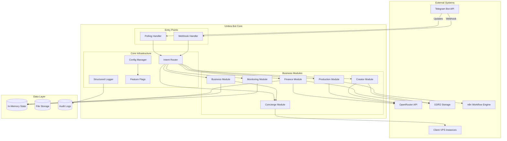
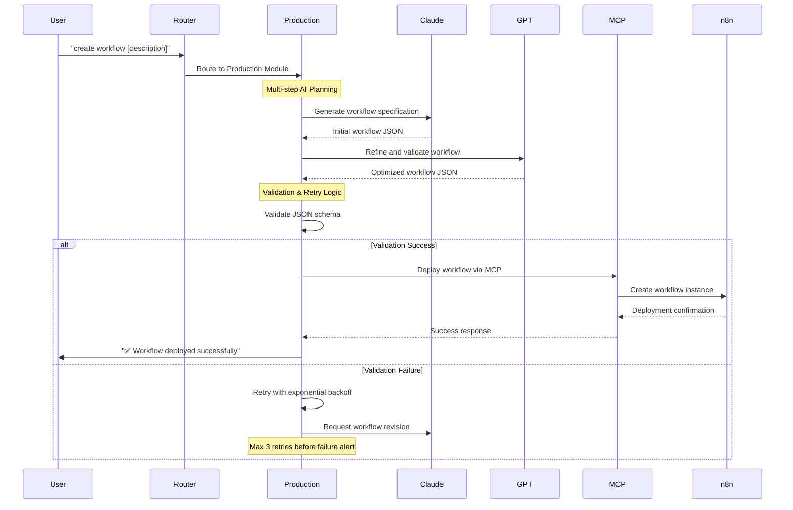
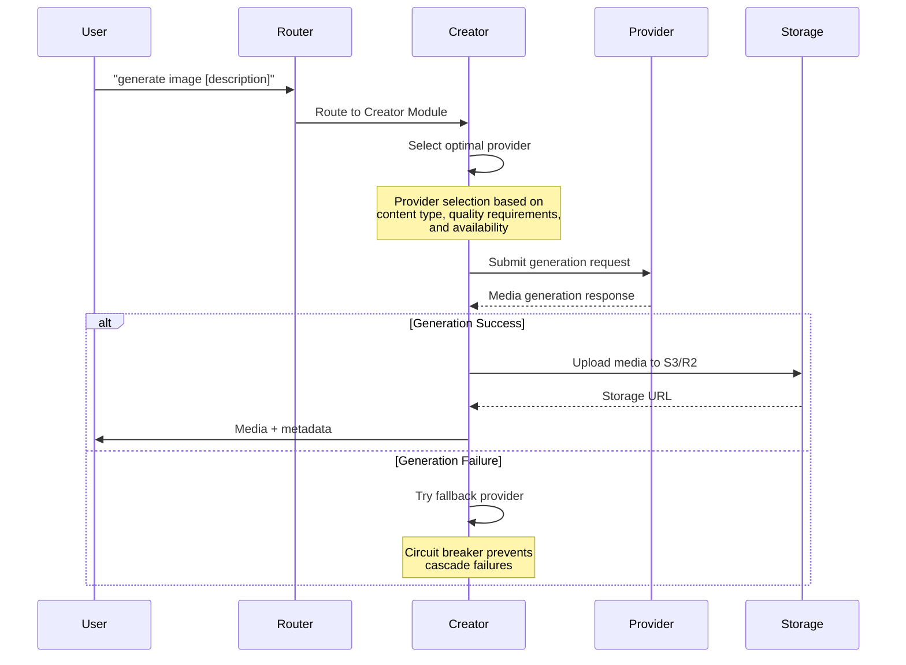
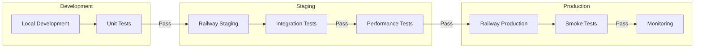

````markdown
# Umbra Bot - Complete Architecture & Implementation Guide

A comprehensive guide to the Umbra Bot system architecture, implementation patterns, and operational excellence practices for building a robust monolithic Telegram bot with modular design.

## Table of Contents

1. [Reference Architecture](#reference-architecture)
2. [Module Specifications](#module-specifications)
3. [API Contracts](#api-contracts)
4. [Routing & Orchestration Policy](#routing--orchestration-policy)
5. [Security & Compliance](#security--compliance)
6. [Deployment Topology](#deployment-topology)
7. [Error Handling & SRE](#error-handling--sre)
8. [Acceptance Criteria](#acceptance-criteria)
9. [Implementation Roadmap](#implementation-roadmap)

## Reference Architecture

### System Overview



### Workflow Creation Flow



### Media Generation Flow



## Module Specifications

### Umbra Core Module

**Purpose**: Central orchestration and infrastructure services

**Responsibilities**:
- Intent classification and routing
- Request/response lifecycle management
- Structured logging and audit trails
- Configuration and feature flag management
- Health monitoring and system metrics

**Key Components**:
```typescript
interface UmbraCore {
  intentRouter: IntentRouter;
  logger: StructuredLogger;
  configManager: ConfigManager;
  featureFlags: FeatureFlagManager;
  healthMonitor: HealthMonitor;
}

interface IntentRouter {
  classifyIntent(message: string, language: string): Promise<Intent>;
  routeToModule(intent: Intent, envelope: InternalEnvelope): Promise<ModuleResult>;
}
```

### Finance Module

**Purpose**: Financial document processing and expense management

**Capabilities**:
- OCR document processing (receipts, invoices, statements)
- Expense categorization and VAT calculation
- Budget reporting and financial analytics
- Multi-currency support

**API Contract**:
```typescript
interface FinanceModule {
  processDocument(document: UploadedFile): Promise<FinancialDocument>;
  categorizeExpense(amount: number, description: string): Promise<ExpenseCategory>;
  generateBudgetReport(period: DateRange): Promise<BudgetReport>;
}

interface FinancialDocument {
  vendor: string;
  amount: number;
  currency: string;
  date: Date;
  vatAmount?: number;
  category: ExpenseCategory;
  confidence: number;
}
```

**Dependencies**:
- Tesseract OCR engine
- OpenCV for image preprocessing
- Storage service for document archival

### Business Module

**Purpose**: Client lifecycle management and project coordination

**Capabilities**:
- Client onboarding and resource provisioning
- Project tracking and milestone management
- Task delegation to specialized modules
- Business metrics and KPI monitoring

**API Contract**:
```typescript
interface BusinessModule {
  createClient(name: string, requirements: ClientRequirements): Promise<Client>;
  assignProject(clientId: string, project: ProjectSpec): Promise<Project>;
  delegateTask(task: Task, targetModule: ModuleName): Promise<TaskResult>;
}

interface Client {
  id: string;
  name: string;
  status: ClientStatus;
  vpsResources: VPSResource[];
  projects: Project[];
  createdAt: Date;
}
```

### Production Module

**Purpose**: AI-powered workflow creation and automation

**Capabilities**:
- Multi-step AI planning with Claude and GPT
- JSON workflow specification generation
- n8n integration and deployment
- Workflow versioning and rollback

**API Contract**:
```typescript
interface ProductionModule {
  createWorkflow(description: string): Promise<WorkflowResult>;
  deployWorkflow(workflowId: string): Promise<DeploymentResult>;
  validateWorkflowJSON(json: object): Promise<ValidationResult>;
}

interface WorkflowResult {
  id: string;
  name: string;
  description: string;
  nodes: WorkflowNode[];
  connections: NodeConnection[];
  status: WorkflowStatus;
}
```

### Creator Module

**Purpose**: Multi-provider media generation and asset management

**Capabilities**:
- Image generation (DALL-E, Midjourney, Stable Diffusion)
- Video creation (Runway, Pika)
- Audio synthesis (ElevenLabs, OpenAI TTS)
- Provider selection and fallback handling

**API Contract**:
```typescript
interface CreatorModule {
  generateImage(prompt: string, options: ImageOptions): Promise<MediaResult>;
  createVideo(prompt: string, options: VideoOptions): Promise<MediaResult>;
  synthesizeAudio(text: string, voice: VoiceOptions): Promise<MediaResult>;
}

interface MediaResult {
  url: string;
  metadata: MediaMetadata;
  provider: string;
  generationTime: number;
  cost: number;
}
```

### Concierge Module

**Purpose**: VPS management and infrastructure orchestration

**Capabilities**:
- SSH-based server management
- Container deployment and scaling
- Resource monitoring and alerting
- Automated backup and recovery

**API Contract**:
```typescript
interface ConciergeModule {
  createVPS(clientId: string, specs: VPSSpecs): Promise<VPSInstance>;
  deployContainer(vpsId: string, image: string): Promise<DeploymentResult>;
  executeSSHCommand(vpsId: string, command: string): Promise<CommandResult>;
}

interface VPSInstance {
  id: string;
  clientId: string;
  hostname: string;
  ipAddress: string;
  status: VPSStatus;
  resources: ResourceUsage;
}
```

### Monitoring Module

**Purpose**: System health and performance monitoring

**Capabilities**:
- Real-time health checks
- Performance metrics collection
- System resource monitoring
- Alert generation and notification

**API Contract**:
```typescript
interface MonitoringModule {
  getSystemHealth(): Promise<HealthStatus>;
  collectMetrics(): Promise<SystemMetrics>;
  checkModuleStatus(moduleName: string): Promise<ModuleStatus>;
}

interface HealthStatus {
  overall: HealthState;
  modules: Record<string, ModuleHealth>;
  uptime: number;
  timestamp: Date;
}
```

## API Contracts

### Telegram Integration

**Webhook Configuration**:
```typescript
interface TelegramWebhookConfig {
  url: string;
  secretToken: string;
  allowedUpdates: UpdateType[];
  dropPendingUpdates: boolean;
}

// Webhook endpoint
POST /webhook/telegram
Headers:
  X-Telegram-Bot-Api-Secret-Token: <secret>
Body: TelegramUpdate
```

**Polling Configuration**:
```typescript
interface TelegramPollingConfig {
  timeout: number;
  limit: number;
  allowedUpdates: UpdateType[];
  retryInterval: number;
}
```

### OpenRouter Integration

**Authentication**:
```typescript
interface OpenRouterClient {
  apiKey: string;
  baseURL: string;
  timeout: number;
}

// Request format
POST https://openrouter.ai/api/v1/chat/completions
Headers:
  Authorization: Bearer <api-key>
  Content-Type: application/json
Body: {
  model: string;
  messages: ChatMessage[];
  temperature?: number;
  max_tokens?: number;
}
```

### MCP (Model Context Protocol) Integration

**Provider Configuration**:
```typescript
interface MCPProvider {
  name: string;
  endpoint: string;
  authentication: MCPAuth;
  capabilities: MCPCapability[];
}

interface MCPWorkflowRequest {
  action: 'deploy' | 'update' | 'delete';
  workflowId: string;
  specification: WorkflowSpec;
  environment: 'development' | 'staging' | 'production';
}
```

### External Provider APIs

**Storage Service (S3/R2)**:
```typescript
interface StorageConfig {
  endpoint: string;
  accessKey: string;
  secretKey: string;
  bucket: string;
  region: string;
}

// Upload operation
PUT /{bucket}/{key}
Headers:
  Authorization: AWS4-HMAC-SHA256 <signature>
  Content-Type: <mime-type>
Body: <file-data>
```

**VPS Management**:
```typescript
interface VPSConnection {
  host: string;
  username: string;
  privateKey: string;
  port: number;
}

// SSH command execution
interface SSHCommand {
  command: string;
  timeout: number;
  sudo: boolean;
}
```

## Routing & Orchestration Policy

### Intent Routing Engine

**Classification Strategy**:
```typescript
interface IntentClassifier {
  // Multi-level classification
  classifyIntent(message: string, context: UserContext): Intent;
  
  // Keyword-based classification
  analyzeKeywords(text: string, language: string): KeywordMatch[];
  
  // Context-aware routing
  considerContext(intent: Intent, history: MessageHistory): RoutingDecision;
}

enum IntentType {
  FINANCE = 'finance',
  BUSINESS = 'business', 
  PRODUCTION = 'production',
  CREATOR = 'creator',
  CONCIERGE = 'concierge',
  MONITORING = 'monitoring',
  CHAT = 'chat',
  HELP = 'help'
}
```

**Routing Rules**:
1. **Exact Command Match**: `/start`, `/help` → Direct routing
2. **Keyword Analysis**: Multi-language keyword matching
3. **Context Consideration**: Previous conversation history
4. **Fallback Strategy**: Default to chat/help for ambiguous inputs

**Provider Selection Logic**:
```typescript
interface ProviderSelector {
  selectOptimalProvider(
    request: ServiceRequest,
    constraints: ProviderConstraints
  ): Provider;
  
  // Selection criteria
  evaluateProviders(
    providers: Provider[],
    criteria: SelectionCriteria
  ): ScoredProvider[];
}

interface SelectionCriteria {
  performance: number;      // Response time weight
  cost: number;            // Cost optimization weight  
  quality: number;         // Output quality weight
  availability: number;    // Uptime/reliability weight
}
```

### Message Flow Orchestration

**Envelope Processing Pipeline**:
```typescript
interface ProcessingPipeline {
  // Pipeline stages
  stages: PipelineStage[];
  
  // Execute with monitoring
  execute(envelope: InternalEnvelope): Promise<ModuleResult>;
  
  // Error handling and recovery
  handleStageFailure(stage: PipelineStage, error: Error): Promise<RecoveryAction>;
}

enum PipelineStage {
  AUTHENTICATION = 'auth',
  RATE_LIMITING = 'rate_limit', 
  INTENT_CLASSIFICATION = 'classify',
  MODULE_ROUTING = 'route',
  PROCESSING = 'process',
  RESPONSE_FORMATTING = 'format',
  AUDIT_LOGGING = 'audit'
}
```

## Security & Compliance

### Access Control Matrix

```typescript
interface AccessControlMatrix {
  // User-based permissions
  userPermissions: Record<UserId, Permission[]>;
  
  // Module-level access control
  moduleAccess: Record<ModuleName, AccessPolicy>;
  
  // API endpoint protection
  endpointSecurity: Record<Endpoint, SecurityPolicy>;
}

interface Permission {
  resource: string;
  actions: Action[];
  conditions?: AccessCondition[];
}

enum Action {
  READ = 'read',
  WRITE = 'write', 
  EXECUTE = 'execute',
  DELETE = 'delete',
  ADMIN = 'admin'
}
```

**Role-Based Access Control**:
- **System Admin**: Full system access and configuration
- **Module Owner**: Module-specific administrative access
- **End User**: Basic functionality access
- **Client User**: Client-scoped resource access

### Secrets Management

**Environment Variables**:
```bash
# Core secrets
TELEGRAM_BOT_TOKEN=<telegram-token>
OPENROUTER_API_KEY=<openrouter-key>

# Storage credentials
STORAGE_ACCESS_KEY=<s3-access-key>
STORAGE_SECRET_KEY=<s3-secret>

# VPS management
VPS_PRIVATE_KEY=<ssh-private-key>

# External API keys
RUNWAY_API_KEY=<runway-key>
ELEVENLABS_API_KEY=<elevenlabs-key>
```

**Secret Rotation Policy**:
```typescript
interface SecretRotation {
  schedule: RotationSchedule;
  providers: SecretProvider[];
  notifications: NotificationChannel[];
}

interface RotationSchedule {
  telegramToken: Duration;    // 90 days
  apiKeys: Duration;          // 60 days
  sshKeys: Duration;          // 30 days
  storageCredentials: Duration; // 45 days
}
```

### Validation Gates

**Input Validation**:
```typescript
interface ValidationGate {
  // Message validation
  validateMessage(message: TelegramMessage): ValidationResult;
  
  // File upload validation
  validateFile(file: UploadedFile): ValidationResult;
  
  // API request validation
  validateAPIRequest(request: APIRequest): ValidationResult;
}

interface ValidationRules {
  maxMessageLength: number;     // 4096 characters
  allowedFileTypes: string[];   // pdf, jpg, png, etc.
  maxFileSize: number;          // 20MB
  rateLimits: RateLimit[];      // Per user/endpoint limits
}
```

### Audit Logging

**Audit Event Structure**:
```typescript
interface AuditEvent {
  timestamp: Date;
  eventId: string;
  userId: string;
  module: string;
  action: string;
  resource: string;
  outcome: 'success' | 'failure' | 'error';
  details: Record<string, any>;
  ipAddress?: string;
  userAgent?: string;
}

// Critical events to audit
enum AuditableAction {
  USER_LOGIN = 'user_login',
  DOCUMENT_UPLOAD = 'document_upload',
  WORKFLOW_DEPLOY = 'workflow_deploy',
  VPS_ACCESS = 'vps_access',
  CONFIG_CHANGE = 'config_change',
  SECRET_ACCESS = 'secret_access'
}
```

## Deployment Topology

### Railway Services Configuration

**Primary Service (Bot)**:
```yaml
# railway.toml
[build]
  builder = "dockerfile"
  
[deploy]
  healthcheckPath = "/health"
  healthcheckTimeout = 60
  restartPolicyType = "on-failure"
  restartPolicyMaxRetries = 3

[[services]]
  name = "umbra-bot"
  source = "."
  
  [services.env]
    PORT = "8080"
    NODE_ENV = "production"
    
  [[services.variables]]
    TELEGRAM_BOT_TOKEN = { $ref = "TELEGRAM_BOT_TOKEN" }
    OPENROUTER_API_KEY = { $ref = "OPENROUTER_API_KEY" }
```

**Storage Service**:
```yaml
[[services]]
  name = "umbra-storage"
  source = "./storage"
  
  [services.env]
    STORAGE_TYPE = "s3"
    
  [[services.variables]]
    STORAGE_ACCESS_KEY = { $ref = "STORAGE_ACCESS_KEY" }
    STORAGE_SECRET_KEY = { $ref = "STORAGE_SECRET_KEY" }
```

### Dockerfile Pattern

```dockerfile
# Multi-stage build for optimization
FROM python:3.11-slim as builder

# Install system dependencies
RUN apt-get update && apt-get install -y \
    tesseract-ocr \
    tesseract-ocr-por \
    tesseract-ocr-fra \
    libopencv-dev \
    && rm -rf /var/lib/apt/lists/*

# Copy requirements and install Python dependencies
COPY requirements.txt .
RUN pip install --no-cache-dir -r requirements.txt

# Production stage
FROM python:3.11-slim

# Copy system dependencies
COPY --from=builder /usr/bin/tesseract /usr/bin/tesseract
COPY --from=builder /usr/share/tesseract-ocr /usr/share/tesseract-ocr

# Copy Python dependencies
COPY --from=builder /usr/local/lib/python3.11/site-packages /usr/local/lib/python3.11/site-packages

# Create non-root user
RUN useradd --create-home --shell /bin/bash umbra
USER umbra
WORKDIR /home/umbra

# Copy application code
COPY --chown=umbra:umbra . .

# Health check configuration
HEALTHCHECK --interval=30s --timeout=10s --start-period=5s --retries=3 \
  CMD python -c "import requests; requests.get('http://localhost:8080/health')"

# Default command
CMD ["python", "-m", "umbra.bot"]
```

### Environment Promotion Flow



**Promotion Criteria**:
- All unit tests passing
- Code coverage > 80%
- Security scan clear
- Performance benchmarks met
- Manual approval for production

### Health Checks

**Endpoint Implementation**:
```typescript
interface HealthCheck {
  // Service health endpoint
  GET /health: HealthStatus;
  
  // Detailed system status
  GET /api/monitoring/status: SystemStatus;
  
  // Module-specific health
  GET /api/monitoring/modules/{module}: ModuleHealth;
}

interface HealthStatus {
  status: 'healthy' | 'degraded' | 'unhealthy';
  timestamp: string;
  uptime: number;
  version: string;
  checks: HealthCheckResult[];
}
```

**Check Categories**:
```typescript
enum HealthCheckType {
  DATABASE_CONNECTION = 'database',
  EXTERNAL_API = 'external_api',
  STORAGE_ACCESS = 'storage',
  MEMORY_USAGE = 'memory',
  CPU_USAGE = 'cpu',
  DISK_SPACE = 'disk'
}

interface HealthCheckResult {
  name: string;
  type: HealthCheckType;
  status: 'pass' | 'fail' | 'warn';
  latency?: number;
  message?: string;
}
```

## Error Handling & SRE

### Error Taxonomy

**Error Classification**:
```typescript
enum ErrorCategory {
  // User errors (4xx equivalent)
  INVALID_INPUT = 'invalid_input',
  UNAUTHORIZED = 'unauthorized', 
  RATE_LIMITED = 'rate_limited',
  
  // System errors (5xx equivalent)
  SERVICE_UNAVAILABLE = 'service_unavailable',
  TIMEOUT = 'timeout',
  RESOURCE_EXHAUSTED = 'resource_exhausted',
  
  // Business logic errors
  VALIDATION_FAILED = 'validation_failed',
  WORKFLOW_ERROR = 'workflow_error',
  PROCESSING_FAILED = 'processing_failed'
}

interface ErrorInfo {
  category: ErrorCategory;
  code: string;
  message: string;
  retryable: boolean;
  retryAfter?: number;
  context?: Record<string, any>;
}
```

### Retry Mechanisms

**Retry Strategy Configuration**:
```typescript
interface RetryConfig {
  maxAttempts: number;
  baseDelay: number;        // milliseconds
  maxDelay: number;         // milliseconds
  multiplier: number;       // exponential backoff
  jitter: boolean;          // randomization
}

// Default retry configurations
const RETRY_CONFIGS = {
  external_api: {
    maxAttempts: 3,
    baseDelay: 1000,
    maxDelay: 30000,
    multiplier: 2,
    jitter: true
  },
  file_processing: {
    maxAttempts: 2,
    baseDelay: 2000,
    maxDelay: 10000,
    multiplier: 1.5,
    jitter: false
  }
};
```

### Circuit Breaker References

**Circuit Breaker States**:
```typescript
enum CircuitState {
  CLOSED = 'closed',        // Normal operation
  OPEN = 'open',           // Failing fast
  HALF_OPEN = 'half_open'  // Testing recovery
}

interface CircuitBreakerConfig {
  failureThreshold: number;    // Failures to trigger open
  successThreshold: number;    // Successes to close
  timeout: number;             // Time before half-open
  monitoringWindow: number;    // Rolling window size
}
```

### Runbooks

**Incident Response Procedures**:

1. **High Error Rate Alert**:
```bash
# Check system status
curl -s https://umbra-bot.railway.app/health | jq .

# Check module-specific health
curl -s https://umbra-bot.railway.app/api/monitoring/modules/finance

# View recent logs
railway logs --tail 100

# Scale if needed
railway scale --replicas 2
```

2. **Database Connection Issues**:
```bash
# Verify connectivity
python -c "from umbra.core.config import get_db_config; print(get_db_config())"

# Test connection
python -c "import psycopg2; psycopg2.connect('...')"

# Restart service if needed
railway redeploy
```

3. **External API Degradation**:
```bash
# Check provider status
curl -s https://openrouter.ai/health

# Enable circuit breaker
railway variables set CIRCUIT_BREAKER_ENABLED=true

# Switch to fallback provider
railway variables set FALLBACK_PROVIDER=claude-3-haiku
```

## Acceptance Criteria

### Functional Requirements

**Core Functionality**:
- [ ] Bot responds to all documented commands
- [ ] Multi-language support (EN/FR/PT) working
- [ ] Intent classification accuracy > 95%
- [ ] File upload processing functional
- [ ] Workflow generation and deployment working
- [ ] VPS management operations successful
- [ ] Media generation with multiple providers

**Performance Requirements**:
- [ ] Response time < 2 seconds for text commands
- [ ] File processing < 30 seconds for documents
- [ ] Workflow deployment < 60 seconds
- [ ] System uptime > 99.5%
- [ ] Memory usage < 512MB per instance

### Test Plan Outlines

**Unit Tests**:
```typescript
describe('IntentRouter', () => {
  test('classifies finance intent correctly');
  test('handles multi-language input');
  test('falls back to help for ambiguous input');
});

describe('FinanceModule', () => {
  test('processes PDF invoices');
  test('extracts amounts and dates');
  test('categorizes expenses correctly');
});
```

**Integration Tests**:
```typescript
describe('End-to-End Workflows', () => {
  test('complete document processing flow');
  test('workflow creation and deployment');
  test('client onboarding process');
});
```

**Load Tests**:
```bash
# Artillery configuration
config:
  target: 'https://umbra-bot.railway.app'
  phases:
    - duration: 60
      arrivalRate: 10
    - duration: 120
      arrivalRate: 50

scenarios:
  - name: "Message processing"
    requests:
      - post:
          url: "/webhook/telegram"
          json:
            message:
              text: "help"
              from:
                id: 123456789
```

## Implementation Roadmap

### Phase 1: Foundation (Weeks 1-2)
**Objectives**:
- ✅ Core bot infrastructure with polling
- ✅ Module registration and lifecycle
- ✅ Basic intent routing
- ✅ Structured logging
- ✅ Docker containerization

**Deliverables**:
- ✅ Runnable bot with basic commands
- ✅ Health monitoring system
- ✅ CI/CD pipeline setup
- ✅ Railway deployment

### Phase 2: Core Modules (Weeks 3-4)
**Objectives**:
- [ ] Complete Finance module with OCR
- [ ] Full Production module with AI workflow generation
- [ ] Enhanced Business module with client management
- [ ] Webhook mode implementation
- [ ] Advanced error handling

**Deliverables**:
- [ ] Document processing capabilities
- [ ] AI-powered workflow creation
- [ ] Client lifecycle management
- [ ] Comprehensive test suite

### Phase 3: Advanced Features (Weeks 5-6)
**Objectives**:
- [ ] Creator module with multi-provider support
- [ ] Concierge module with VPS management
- [ ] Circuit breaker and retry mechanisms
- [ ] Performance optimization
- [ ] Security hardening

**Deliverables**:
- [ ] Media generation pipeline
- [ ] Infrastructure automation
- [ ] Resilience patterns implementation
- [ ] Security audit completion

### Phase 4: Production Ready (Weeks 7-8)
**Objectives**:
- [ ] Load testing and optimization
- [ ] Monitoring and alerting
- [ ] Documentation completion
- [ ] Operational runbooks
- [ ] Backup and recovery procedures

**Deliverables**:
- [ ] Production deployment
- [ ] Monitoring dashboards
- [ ] Incident response procedures
- [ ] Performance benchmarks

### Metrics & KPIs

**Technical Metrics**:
- Response time percentiles (P50, P95, P99)
- Error rate by module and operation
- System resource utilization
- API success rates and latencies

**Business Metrics**:
- User engagement and retention
- Document processing accuracy
- Workflow deployment success rate
- Cost per operation by provider

**Operational Metrics**:
- System uptime and availability
- Mean time to recovery (MTTR)
- Deployment frequency and success rate
- Security incident frequency

### Priority Matrix

**High Priority (Must Have)**:
- Core message processing and routing
- Finance document processing
- Basic workflow creation
- System health monitoring
- Security and authentication

**Medium Priority (Should Have)**:
- Multi-provider media generation
- VPS management capabilities
- Advanced error handling
- Performance optimization
- Comprehensive testing

**Low Priority (Nice to Have)**:
- Advanced analytics and reporting
- Custom workflow templates
- Multi-tenant support
- Advanced monitoring dashboards
- API rate limiting

---

*This guide provides the comprehensive architecture foundation for building, deploying, and maintaining the Umbra Bot system. For specific implementation details, refer to the individual module documentation and operational runbooks.*
````